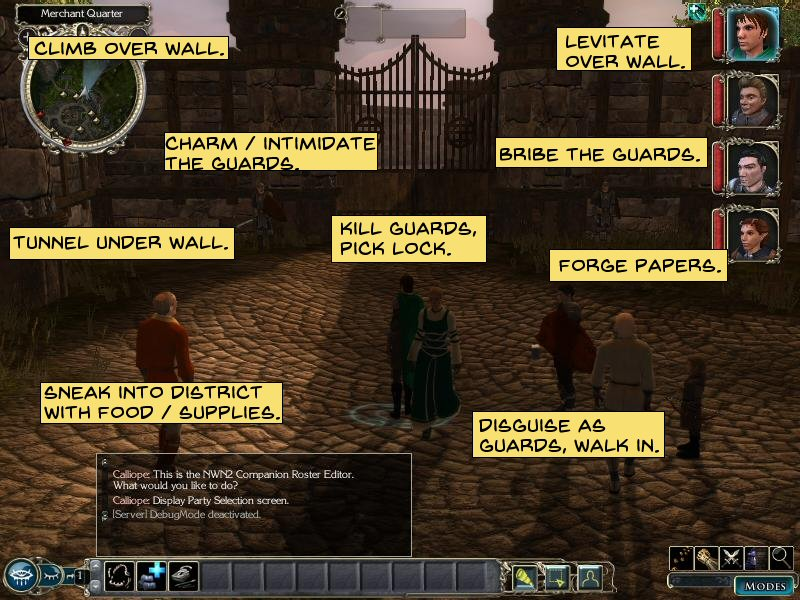

Ah. The first encounter.

Normally I'd describe what it *is* first, say what I like about it, then say what I think it *should* be.
But what it *is* is complicated to talk about. In particular, the deadliness of this encounter varies widely from DM to DM. I think this is because the text really doesn't do a good job of handholding for new DMs. Mind you, a complicating factor is that most of the relevant rules changed between 3.0 and 3.5. (And trust me, you want to use the 3.5 version. [That's what we went over for the prospective twig blight encounter.](/sunless-citadel-twig-blights) It's relatively simple to grasp while having some strategic depth; the 3.0 version is a lot harder to learn and understand for simple situations.)

So first let's talk a bit at the high level, about broadly what this encounter is trying to do.

The basic concept is this: when a character climbs down the cliff, they are attacked by Rodents Of Unusual Size.
The two key features of this encounter is that it is quite dangerous on its own, but has no ripple effects for the rest of the dungeon.

When I say that this encounter has a high chance of outright killing a PC, I want to be clear that I don't intend that as a criticism. If a PC is going to die, now is the best possible time, *provided* that you've properly prepared for it.

The problem with main character death is that a main character is entangled with the ongoing story, and you can't easily swap in another character to take over their role.
You can mitigate this by having backup characters already created. At a bare minimum, this means the unfortunate player won't have to roll up a new character in the middle of an adventure. If the backup characters hang around on the periphery of the story, they're at least established characters. Of course, keeping them involved enough that they can seamlessly become main characters is a pain. Even just creating them is a pain. Creating and maintaining backup characters is like creating detailed writeups of towns --- technically it's always better to do it than to *not* do it, but it's not necessarily the best use of your time.
If you have a backup character available, though, dealing with PC death that happens *right at the start of the story* is uniquely easy. The PC hasn't had time to acquire any narrative weight.

The other problem with character death is that it kills fear.

> Suddenly they realize that the death they feared is more of an inconvenience than a source of terror. They remember that it's all just a game, and that they just lost...they are out of the game and death is no longer the great unknown. It's going to take them a while to settle back into character.
>
> Which means that --- counter-intuitively --- if you want to scare a player you should make every effort to avoid killing them.
>
> When it comes to movies, people like Spielberg regularly use this sort of thing to create nail-biting moments. If you take yourself out of the movie for a second, you know Spielberg isn't going to let the dinosaur eat the little girl. You know she's going to live until the end of the movie. Yet when the dino is snapping and missing her face by an inch it's still edge-of-seat time, because you're immersed in the movie. This often works even when you've seen the movie before and there can be no doubt in your mind about the survival of the girl. You're fully aware that the real threat is zero, yet the perceived threat is off the charts. (Assuming you're into dino movies. Naturally tastes differ.)
>
> If you're too gentle, the illusion will be broken and the player will realize you're all bark and no bite. The real art of scaring the player --- behind the monsters and spooky sounds and blood and frightening imagery --- is to strike the right balance between these two extremes, to make the perceived threat as high as possible and the real threat as low as possible. Again, killing the player is bad, but revealing that monsters aren't an imminent mortal threat is worse.
>
> --- <cite>[Games and the Fear of Death](https://www.shamusyoung.com/twentysidedtale/?p=1828)</cite>

But that's actually okay, because we're not trying to make anyone afraid, right here. We want them to be afraid of the twig blights. And the twig blights do this exactly right: perceived threat high, real threat almost nil. But right now, we're not trying to make anyone afraid of rats. They're not going to be afraid of rats. The first encounter of the dungeon is about setting up the rules of how you're supposed to approach a dungeon. If you're careless, you *will* die.


The flip side is that while the encounter is *individually* difficult, it's nigh-impossible for this first encounter to have any lasting consequences. (Except for, you know, that one character dying.) The monsters in the initial encounter aren't affiliated with any faction, so if some of them escape, it won't result in a posse chasing the PCs. In fact, they're literally wild animals, so even if all of them escape, it's not like they're going to seek revenge.

It's best to explain this latter by considering the alternative. Suppose that the module didn't force the contrivance of the kobolds *just happening* to show up and lay siege to the goblins. And suppose that the module didn't contrive to have these rats *just happen* to show up here after the previous adventurers passed. In that case, the first encounter would be...a goblin ambush. Right? The goblins are the primary antagonists (at the moment). Goblins like ambushes.

In that alternative, it's very possible to effectively fail the entire adventure in the first encounter.
There exist complex social problems that communities fail to unite to oppose, but mass murder by strangers is not one of those problems.

Nor is an ambush necessarily a bad thing. Ambushes are great.

Ambushes in D&D can be underwhelming if you just throw them in without considering *why* this particular monster would lie in ambush.
There are a few possible reasons.

#### Fragility

First, perhaps this monster is particularly fragile, but has an attack that degrades the target's ability to defend themselves.
For example, a puppeteer can be easily squished by hand, but has the psionic ability to charm victims [Expanded Psionics Handbook].
A puppeteer really doesn't want to meet someone without the adventage of surprise. In terms of game mechanics, no surprise means an opposed initiative roll --- which the puppeteer might lose, and then it's all over. With the advantage of surprise, the puppeteer gets a "free" standard action to use for its psionic charm.

The key abilities a monster needs for this role are *stealth* and *effective range*.

Stealth, in this context, means detecting the target before they detect you. Enhanced senses are just as useful as the ability to remain unseen...to a point. That point is the monster's effective range.

The effective range of a puppeteer is exactly 25 feet --- the range of a psionic charm. If the target comes within 25 feet of the puppeteer without detecting the puppeteer, then the ambush has succeeded. (Well, "succeeded" --- the target might still resist the charm, or be saved by their companions, or any number of other things. The puppeteer might find to its chagrin that the target is not a humanoid --- other more powerful creatures can use psionic charm on creatures other than humanoids, but a puppeteer has only manifester level 1 [Expanded Psionics Handbook]. The puppeteer might still get squished eventually. But it successfully executed the ambush.)

If a monster has no ranged attacks, such as a dire rat, then its effective range is the distance it can charge in the surprise round --- its movement speed. For a dire rat, that's 40 feet horizontally or 20 feet climbing.

> Your Hide check is opposed by the Spot check of anyone who might see you...Normally, you make a Hide check as part of movement...
>
> Use this skill to notice bandits waiting in ambush, to see a rogue lurking in the shadows...or to see the monstrous centipede in the pile of trash.
>
> Typically, your Spot check is opposed by the Hide check of the creature trying not to be seen...
>
> The Dungeon Master may call for Spot checks to determine the distance at which an encounter begins. A penalty applies on such checks, depending on the distance between the two individuals or groups...
>
> --- <cite>Player's Handbook, pages 76 and 83</cite>

A Spot check takes a penalty of -1 per 10 feet of distance [Player's Handbook page 83]. Thus, the longer the ambusher's effective range, the easier it is to Hide.

A puppeteer has a Hide bonus of +22 [Expanded Psionics Handbook]. That's...high. If the puppeteer takes 10 to Hide, that's an effective Spot DC of 33 (the puppeteer's Hide check result is 32, and the puppeteer is almost certain to win a tie on the opposed check with its much higher bonus). Even if the target is proceeding *very* slowly and cautiously, rolling multiple Spot checks every time they take a step, they won't see the puppeteer until it's too late --- at 30 feet they have a Spot penalty of -3, and even rolling a 20 they'd need a Spot bonus of at least +16, which very few creatures have. Meanwhile, the puppeteer has 60-foot blindsight [Expanded Psionics Handbook], so unless the target has very specific defenses (such as the Darkstalker feat or being incorporeal), the puppeteer will know it's coming.

But what if the target never comes within range? Then the puppeteer would have to move. And while a puppeteer is great at lying in wait, it's not so good at moving silently. Even though a puppeteer isn't very big, depending on the surface it has to move on, it may make a lot of noise when skittering forward. (If you don't believe me, clearly your apartment has never had cockroaches.) Even if there's some form of cover the puppeteer can use to hide while moving, the target may be alerted to its presence by hearing it.

Every potential ambusher has strengths and weaknesses like that. If the ambush fails for any reason, then the would-be ambusher must choose fight or flight --- try a desperate attack anyway, or attempt to flee. Which it chooses depends on its intelligence and its own estimation of which is more likely to allow it to survive. A puppeteer, being an intelligent creature has a third option --- attempt to surrender. Maybe even try to bluff that it really wasn't going to attack, honest.

#### Lack of reach

> Characters are flat-footed until their first turns in the initiative cycle. A flat-footed creature loses its Dexterity bonus to Armor Class (if any) and cannot make attacks of opportunity.
>
> -- <cite>Player's Handbook, Glossary</cite>

It's pretty unusual for a creature's Dexterity bonus to Armor Class to make *that* big of a difference, especially at low levels. And lots of things can deny a Dex bonus to AC.
That second clause, though, is interesting. Tiny and smaller melee-oriented creatures typically provoke attacks of opportunity just trying to close with their opponents.

> They must enter an opponent's square to attack in melee. This provokes an attack of opportunity from the opponent.
>
> <cite>Player's Handbook, page 149</cite>

This is related to the "monster is fragile" condition, since this makes the most difference when they really can't take even a single hit (as most creatures of that size cannot).

For example, a tiny monstrous centipede normally cannot easily get close enough to bite, but in a surprise round it can dash 20 feet (either horizontally or vertically along a wall) to attack [Monster Manual, Chapter 3: Vermin].

Of course, while some ambush predators in the real world have reason to be worried about their prey fighting back, most are more worried about their prey *getting away*.

#### Lethargy

If a creature has short effective range and slow movement speed relative to its prey, then ambush may be its only way to get close enough.

An example is the alligator snapping turtle.

> Alligator snapping turtles have long, narrow tongues equipped with an appendage that looks like a worm to attract prey. Algae growing on these turtles' backs lends camouflage among the muddy river beds they inhabit...When hunting, these ambush predators stay motionless in the water and reveal the worm-like appendage on their tongues to lure unsuspecting prey.
>
> --- <cite>[Smithsonian's National Zoo & Conservation Biology Institute](https://nationalzoo.si.edu/animals/alligator-snapping-turtle)</cite>

The "my tongue is totally a worm" gambit is probably not going to fool any player characters, but works well enough on the turtle's prey.

In D&D, an assassin vine is a *technically*-ambulatory plant, but is far too slow to chase down prey, so it camouflages itself and waits in ambush [Monster Manual].

#### Formations

An ambush on a group could be for the purpose of getting at the back ranks who would otherwise be protected. This obviously has a great deal of history in real-world military strategy, and it's also applicable to adventuring parties with squishy wizards.

But to finally get to the point, sometimes the purpose of an ambush is to catch the targets in a vulnerable position --- a position that they wouldn't put themselves into if they knew there were nearby enemies waiting to attack.

#### Tactical advantage

The obvious example is catching individuals alone, but [in the case of PCs, they almost never split up even when there aren't enemies nearby](https://allthetropes.fandom.com/wiki/Never_Split_the_Party).
Which isn't to say it's impossible --- if there's a place where only one party member can reach (perhaps only one character is a good enough jumper to leap the chasm), and they're given a reason to investigate the area, an ambush could theoretically catch them there.

For high-level parties, this often just means catching them without their buff spells up.
For low-level parties, this means catching them while they're attempting to navigate difficult terrain.

Technically, any difficult terrain will work if the ambushers attack with ranged weapons. An ice bridge, for example.

> An ice bridge is a slippery surface. Anyone walking on it must make a DC 10 Balance check to move at half speed along the surface for 1 round...If a character moves through a square that overlaps the edge of the bridge (no matter how much of the square remains ice bridge and how little remains open air), he must instead make a DC 22 Balance check.
>
> If the character falls prone, he might slide across the icy surface. The chance for sliding and the direction he slides depends on the situation that made him fall. Simply falling while trying to move brings a 25% chance of a 5-foot slide in the direction he was moving. This assumes he has moved 15 feet or less when he falls; he slides an additional 5 feet if he has traveled more than 15 feet in the current round.
>
> Sliding can provoke attacks of opportunity if the character slides through a threatened square.
>
> Falling as a result of being attacked brings a 50% chance of a slide directly away from the direction of the attack. The character slides for 5 feet in this case.
>
> If a character slides while on a square occupied by the bridge's edge, or if he slides into such a square, he immediately falls off the edge of the bridge and takes falling damage...
>
> --- <cite>Dungeon Master's Guide II, pages 52--53</cite>

> You are considered flat-footed while balancing, since you can't move to avoid a blow, and thus you lose your Dexterity bonus to AC (if any)...If you take damage while balancing, you must make another Balance check against the same DC to remain standing.
>
> --- <cite>Player's Handbook, page 67</cite>

Of particular interest, though, are paths that are difficult for the ambushees but not for the ambushers.

The most obvious example is cramped tunnels populated by tiny creatures.

#### Cramped spaces

For example, suppose that the PCs see an obvious threat ahead of them, such as a spiked pit. But a search reveals [a hidden crawlspace that goes around the pit](https://allthetropes.fandom.com/wiki/Schmuck_Bait).

Lurking nearby, invisible, is a quasit --- a demon about the size of a housecat but eight times as vicious [Monster Manual]. If the characters try to crawl through the crawlspace, the quasit ambushes them.

> Restrictive tunnels can impede movement in two ways; they can have low ceilings, forcing tall creatures to crouch or even crawl. They can also have narrow widths, forcing larger creatures to squeeze through tight openings...
>
> Any creature fighting in a cramped space loses its Dexterity bonus (if any) to Armor Class...
>
> Narrow or Low: An area that is smaller horizontally than a creature's space or smaller vertically than a creature's height falls into this category, so long as the constricted dimension is at least one-half the creature's space or height, respectively.
>
> A creature in such a space moves at half its normal speed because of the cramped conditions, and running and charging are impossible. The cramped creature takes a -2 circumstance penalty on attack rolls with light weapons and a -4 circumstance penalty on attack rolls with one-handed weapons. It cannot use two-handed weapons at all.
>
> Narrow and Low: An area that is smaller in both the horizontal and vertical dimensions than the creature's space falls into this category, so long as each of the constricted dimensions is at least one-half the creature's space or height, respectively. A creature in these conditions moves at one-quarter normal speed and takes attack penalties equal to twice those indicated above.
>
> Crawl-Navigable: An area less than one-half but at least one-quarter of the creature's height is crawl-navigable. The creature can move through such space by falling prone and crawling at a speed of 5 feet (1 square), but it must remove medium and heavy armor, backpacks, and other bulky equipment (although they can be dragged along behind). The normal penalties for being prone apply. The only ranged weapon a creature in a crawl-navigable space can use is a crossbow.
>
> Awkward Space: An awkward space is narrower than narrow, lower than low, or smaller than crawl-navigable, but not quite a tight space. A creature in such a space can move 5 feet (1 square) with a DC 15 Escape Artist check. Fighting in an awkward space is possible only with light weapons, and the creature takes a -8 circumstance penalty on its attack rolls. The only ranged weapon a creature in an awkward space can use is a crossbow.
>
> Tight Squeeze: A tight squeeze is an area larger than the creature's head but smaller than its shoulders, as described in the Escape Artist skill description. The creature can move 5 feet (1 square) with a DC 30 Escape Artist check. Fighting in a tight squeeze is impossible.
>
> --- <cite>Dungeon Master's Guide II, page 55</cite>

Note that a creature's *space* is standardized by creature size --- 5 feet for Medium-size creatures. For simplicity, every creature in the same size category has the same space, just as every Medium-size creature has exactly 8 feet of vertical reach.
However, a chamber that is not narrow is defined to be "low" based on a creature's *actual height*.

The category of "narrow and low" at first appears redundant, since circumstance penalties stack anyway, and the effects of "narrow and low" are the same as the effects of "narrow" and the effects of "low" applied simultaneously.
But there is a slight difference: for the special case of a cramped tunnel, as opposed to a chamber that has a low ceiling but is not "narrow", the height is standardized to the creature's space rather than its actual height.
So in a low-ceilinged chamber, it's possible for a six-foot-tall human to be hampered while a four-foot-tall dwarf is fine; in a cramped *tunnel*, you don't worry about the minutiae and everyone of the same size category takes the same penalties.
This only applies to this one special case; the definition of "crawl-nevigable" uses the creature's actual height (and width is irrelevant unless it's narrow enough to constitute an "awkward space").

The definition of "awkward space" appears to simply be an error. If any space "lower than low" were always an "awkward space", then the category of "crawl-navigable" would be entirely superfluous.

#### Water

Water is another obvious inconvenience to ambushees. Ancient warfare in the real world often revolved around using and abusing the natural barriers presented by rivers, since crossing under archery fire was nearly impossible and if you happened to catch your enemy in the process of crossing, it was all over.

> If you are underwater, either because you failed a Swim check or because you are swimming underwater intentionally, you must hold your breath. You can hold your breath for a number of rounds equal to twice your Constitution score, but only if you do nothing other than take move actions or free actions. If you take a standard action or a full-round action (such as making an attack), the remainder of the duration for which you can hold your breath is reduced by 1 round. (Effectively, a character in combat can hold his or her breath only half as long as normal.) After that period of time, you must make a DC 10 Constitution check every round to continue holding your breath. Each round, the DC for that check increases by 1. If you fail the Constitution check, you begin to drown.
>
> --- <cite>Player's Handbook page 84</cite>

Aquatic monsters can strike from murky water rather than fire arrows from the shore.
For example, a bloodbloater swarm that happens to be within 30 feet when character swims past can reach them in a surprise round. (They'll *hear* it coming once it starts moving, but by then it's too late.)

> The bloodbloater is a fairly small, flat, disk-shaped ooze about 8 inches in diameter with a bulge at the center. It is milky white with flecks of red.
> Individually, a bloodbloater poses little threat. However, these oozes tend to congregate in swarms...
>
> --- <cite>Fiend Folio page 16</cite>

A bloadbloater swarm is a particularly good example because, like a monstrous diving spider, it deals Strength damage. That directly penalizes Swim checks, and if the character is carrying any gear, it might cause a light load to become a medium load (-6 to Swim checks) or even a heavy load (-12 to Swim checks). The monster interplays with the hazard of the swim itself.

For another means of complementing the water hazard with monsters, if the characters need to swim underwater for some reason, they might run afoul of a sea snake or giant leech or leech swarm, any of which can deal Constitution damage [Stormwrack] and thus reduce the length of time they can hold their breath --- so suddenly they need to get to the surface much earlier than planned.

Note that when swimming on the surface of the water, Listen DCs only increase by 1 per 20 feet of distance and 1 per 30 feet of distance underwater, rather than 1 per 10 feet of distance [Stormwrack page 87]. This can make stalking at a distance harder, but the ambient noise of the water usually increases Listen DCs by at least 5, and land creatures such as humans take a flat -10 penalty to Listen checks if their ears are actually underwater [Stormwrack page 87].

#### Balancing and climbing

Our last category of difficult-for-some-people terrain is two in one:

A narrow ledge (or the stone wall of a tower shell whose wooden roof has long rotted away) requires precarious balancing --- but monsters with climb or fly speeds can ignore it entirely.

Alternatively, suppose there is no ledge and and the characters just have to scale a cliff. Again, monsters with climb or fly speeds have no difficulty. (It's good to have the ledge, though, to enable multiple approaches --- PCs can choose to try to balance or climb.)

This is the complication that The Sunless Citadel uses for the dire-rat ambush.

Do we have special rules for this situation, as we do for ice bridges, narrow tunnels, and water? Boy howdy, do we.

#### Solving a Rubik's cube while playing Guitar Hero

The D&D combat rules are not hard to learn. Really, they're not. You don't need expertise in the quasi-chess of positioning to play the game; all you need is to be minimally competent enough to know what you can do, and that's much easier, since they somewhat match the real world. You can quickly learn how to handle most situations. *Most* situations.

But there are edge cases. Climbing is one of them. This setup complicates simply *knowing what actions are available as options on your turn*. Can you even draw a weapon? Can you cast a spell? Most players, even if they read the Player's Handbook, never thought they were going to need to know the rule for shooting a crossbow one-handed. When choosing spells to cast *on their allies*, they probably didn't pay much attention to which spells actually required them to *touch* their ally versus which spells reached out to Close range (25 feet, *maybe* far enough here) versus which spells reached out to Medium range (110 feet, definitely far enough here).

> You need both hands free to climb, but you may cling to a wall with one hand while you cast a spell or take some other action that requires only one hand. While climbing, you can't move to avoid a blow, so you lose your Dexterity bonus to AC (if any). You also can't use a shield while climbing.
>
> Any time you take damage while climbing, make a Climb check against the DC of the slope or wall. Failure means you fall from your current height and sustain the appropriate falling damage.
>
> --- <cite>Player's Handbook page 69</cite>

> Normally, operating a heavy crossbow requires two hands. However, you can shoot, but not load, a heavy crossbow with one hand at a -4 penalty on attack rolls.
>
> Normally, operating a light crossbow requires two hands. However, you can shoot, but not load, a light crossbow with one hand at a -2 penalty on attack rolls.
>
> --- <cite>Player's Handbook, pages 115--116</cite>

Mercifully, D&D always assumes characters are carrying their gear in the most convenient way, so drawing any weapon is a move action you can take one-handed.
Characters with a positive Base Attack Bonus --- at first level, that means the martial classes, paladins, barbarians, rangers and fighters --- can draw a weapon as a free action combined with a regular move [Player's Handbook page 142].
That makes things simple for normal combat --- but not when taking special move actions such as balancing, swimming and climbing. So in *that* case, drawing a weapon takes a move action, and they can't have had their weapon out in hand already, because they needed both hands to climb.

In fact, since climbing requires both hands, a character who draws a weapon is now stuck in place until they sheathe it or drop it.

Can you cast spells? Yes, in fact, you can, but most people probably won't know that without looking it up.

> A somatic component is a measured and precise movement of the hand. You must have at least one hand free to provide a somatic component.
>
> --- <cite>Player's Handbook page 174</cite>

That's not even all the rules you need to know.

I want to be clear: the problem is not the encounter concept. This is a *great* concept. The problem is everything that came before this encounter...or rather, everything that *didn't* come before.

What this module desperately needs is an opportunity for the players to use the climbing rules, and the combat rules (separately!) *before* this encounter.

> In the Arkham games, after the introduction is done, the game throws you into a very simple combat scenario against a small group of foes. The game makes it easy for you to learn and provides minimal distractions while you try to work out the basic controls. A few minutes later you get one more reminder of how this stuff works, just to make sure you've mastered the fundamentals. Once you have them down, the game begins layering new ideas on top and combining them in different ways.
>
> (I'm comparing to Batman not because I think Batman is the Best Thing Ever, but because it's broadly liked and less likely to attract some yah-hoo who wants to dismiss an entire 1,200 word column because he really hated one of the video games I praised. If you don't like Arkham, there are lots of other games that properly teach you to play. Don't be that guy.)
>
> Teaching the player how to play the game is one of the most important jobs of a game designer. In a movie, if I don't understand the introduction I can still watch the rest of the movie and try to figure it out as I go. But if I don't learn how to play a game then I might find myself unable to proceed.
>
> This is a level of complexity completely inappropriate for the opening of the game, even if the rest of the tutorial wasn't such a mess...there's plenty of room to ramp up the challenge later once the player has the basics.
>
> No, this doesn't ruin the game or anything. I had to retry this mission twice, which was a small annoyance.
>
> --- <cite>[Shamus Young](https://www.escapistmagazine.com/articles/view/video-games/columns/experienced-points/12860-Grand-Theft-Auto-V-s-Amazing-Tech-Whiffs-on-the-Fundamentals)</cite>

As that last line implies, he's talking about a video game. If he dies, well, he just restarts the mission. Death is rather more disruptive in our context.

> Assuming you've been sticking to the main story missions, this is very likely your first time on a bike in this game. You might expect that a game would give you a few seconds to get used to a new system before you use it under pressure --- GTA 4 has certainly been kind of hand-holdy up until now --- but in this case you need to learn how to drive a bike during a high speed chase through twisting streets.
>
> And if you mess up, then you'll likely get knocked off the bike. And by the time you recover, the guy you're chasing will be gone and you'll fail the mission. So you need to learn to drive in a situation where you can't make mistakes.
>
> While you're learning how to ride this bike, the game starts explaining how to drive and shoot at the same time. Driving and shooting is a challenging activity. It's even harder at high speed. Harder still when you're doing a lot of weaving around and chasing an unpredictable target. And harder STILL on a bike. So now you're trying to drive, watch out for cars pulling in front of you, watching where your target is going, and aim your gun, all at the same time. And you have to do all of this under time pressure where almost any mistake can result in complete mission failure?
>
> This sudden difficulty spike doesn't even feel deliberate. Just a couple of missions earlier the game wasted several minutes on a tutorial to walk across the street, pick up a brick, and throw it. (A mechanic that doesn't seem to get used again.) And now all of a sudden it's throwing you into the gameplay equivalent of solving a Rubik's cube while playing Guitar Hero.
>
> And maybe we could forgive this sudden difficulty if it was for a good reason, but this biker guy isn't some boss fight. This isn't a moment of narrative climax. He's never been mentioned before and isn't a big deal.
>
> Let's look at how other games handle their mechanics. Let's look at the Arkham series.
>
> In Arkham, the game begins with a simple base of brawling mechanics and gradually layers depth and complexity as you master these elements. These elements combine to give you more options in a fight. New enemy types require different approaches.
>
> --- <cite>[Shamus Young](https://www.shamusyoung.com/twentysidedtale/?p=25833)</cite>

> It's also bad when games simply take concepts for granted. For game designers, its important to remember that for some small percentage of players out there your AAA shooter will be their first AAA shooter. Crouching, jumping, and using cover are obvious to most players but can be completely mysterious to a newbie. If game designers take too much for granted then they run the risk of making their games too insular. Even if the player knows about all of the mechanics, they might forget which buttons do which things if they step away from the game for a while.
>
> ---<cite>[Shamus Young](https://www.shamusyoung.com/twentysidedtale/?p=20197)</cite>

So: good concept, but it needs more preparation beforehand. So this encounter is fine and we just need to add that prep-work? Well, no. It's not only players who get confused when something complicated is thrown at them.

Up to now, I've been intentionally vague about how the encounter is set up, avoiding direct quotes and talking about the concept only.
That's because I think the text as written is very unclear about the details, and different DMs come away with different impressions of what is supposed to happen. Consequently, the lethality of this encounter varies wildly (and unintentionally!) based on the DM.

It's one thing if a DM looks at an encounter and decides to make it harder (or easier). It's something else entirely if a DM accidentally makes it much harder (or easier) than normal without even realizing the significance of the change. Encounter Level 1 sounds, well, standard for first-level PCs, so the DM isn't necessarily expecting anything radically outside the norm. They aren't necessarily expecting that they have to *pay very close attention*.

It's hard to get broad data, because it takes so much time simply to explain to a DM what the *question* is. But let's take a peek at some campaign journals.

> We are playing PHB only 3.5 to make it easier on the new players.
> Beware the rats in the first encounter: they put down two members of the party when we played. Admittedly there were only three people there that session, but they included a Paladin with STR 18 and CON 18 (he was one of the ones who went down). Many other groups have had similar experiences.
>
> --- <cite>[Capellan](http://www.enworld.org/forum/showthread.php?90653-Any-Helpful-Hints-on-running-Sunless-Citadel)</cite>

> I will echo what Capellan said.
> The initial rats can easily kill characters. Why? Because they have the advantage of being able to ambush and flank a lone character climbing down the rope. We didn't have anyone die there, but did have some folks go unconscious in this fight. Not a real pleasant way to start and adventure.
>
> --- <cite>[Kalendraf](http://www.enworld.org/forum/showthread.php?90653-Any-Helpful-Hints-on-running-Sunless-Citadel)</cite>

> I messed up here.  There are three dire rats in the rubble of the landing 50 feet down from the top of the canyon.  They are supposed to attack the first thing down.  I had forgotten this, so they didn't appear until everyone was already down the rope, and the PC's actually beat them at initiative, so they were skewered quite easily.  From reading on-line it seems that the intended set-up is quite deadly; several writers indicated having killed the first PC down the rope.
>
> --- <cite>[ksbsnowowl](http://www.minmaxboards.com/index.php?topic=14113.0)</cite>

When a DM doesn't mention problems, sometimes if you probe you find out they deliberately made a change.
[Sendric replaced the three dire rats with *one*.](http://dnd.sendric.com/adventures/core/htm/Journal-Part_1.htm)
[Danno eliminated the ambush entirely.](http://dannos-lair.blogspot.com/2017/09/d-with-kids-sunless-citadel-play-report.html)

Now, certainly there are counterexamples. For example, [DragonFriend's group made short work of the ambush.](https://www.myth-weavers.com/showthread.php?t=357555&page=3) But, uh, that group was made up entirely of third-level gestalt characters, so there's that.

> In my Sunless Citadel adventure, one of my PCs almost got killed right off the bat by dropping into a giant rat nest, not ten minutes into the session.
>
> --- <cite>[CrimsonCarcharodon](http://www.enworld.org/forum/showthread.php?654066-Have-the-level-ranking-of-5th-ed-made-levels-1-and-2-pointless&p=7506896&highlight=Sunless+Citadel#post7506896)</cite>

> I started a new campaign last night, running the Yawning Portal version of Sunless Citadel in Eberron for a group consisting of a mix of lapsed and current players. The first thing that happened was a tense, close-to-TPK fight against 3 giant rats.
>
> --- <cite>[Reynard](http://www.enworld.org/forum/showthread.php?653306-Preserving-the-Fear-Inherent-in-1st-Level/page7&p=7491711&highlight=Sunless%20Citadel#post7491711)</cite>

As I said before: If a PC is going to die, now is the best possible time. But I claim there are two big problems here:

* First, the structure is confusing in such a way that the lethality of the ambush is highly DM-dependent. How this plays out depends crucially on assumptions that the DM often doesn't even realize they're making.
* Second, the structure is confusing in such a way that if the party *does* lose a member, it won't be at all clear what they did wrong.

The problems all revolve around the description of the situation being vague and scattered.
The problem starts right away.

> Anyone standing next to the ravine immediately notes a sturdy knotted rope tied to one of the leaning pillars. The rope hangs down into the darkness below...Player characters can also see older and weathered hand- and footholds carved into the cliff face.
>
> Descending: Player characters can easily climb down the knotted rope (Climb check DC 0), using the wall to brace themselves. They descend 50 feet to the citadel foyer (area 2). Attempts to climb down the naked rock using the carved hand- and footholds are more difficult (Climb check DC 10). A failed Climb check indicates that a clumsy climber falls from a height of 25 feet. The fall inflicts 2d6 points of damage.
>
> In addition, you should note whether the player characters take extra care to move quietly. Allow those who want to move quietly to make a Move Silently check (opposed by the rats).
>
> --- <cite>The Sunless Citadel, page 5</cite>

The what? Rats?

> A sandy ledge overlooks a subterranean gulf of darkness to the west. The ledge is wide but rough. Sand, rocky debris, and the bones of small animals cover it. A roughly hewn stairwell zigs and zags down the side of the ledge, descending into darkness.
>
> --- <cite>The Sunless Citadel, page 5</cite>

What about the rats? And why wasn't this ledge described when the PCs were looking down the cliff face? Could they not see it? (Honest question. There's no mention of magical darkness or anything and it looks like light should reach here just fine, but the description of the ravine kept making reference to darkness, like how "The rope hangs down into the darkness below" as if they can't see where the rope terminates.)

> Even PCs with darkvision cannot see the far wall of the chasm, which is 250 feet to the west, nor the bottom of the subterranean vault, which is 80 feet below [the ledge].
>
> --- <cite>The Sunless Citadel, Area 1: Ledge</cite>

If you have more description of the ravine then why wasn't this in the description of what the PCs see looking down?

Well...looking at the map, the western wall of the ravine is actually an overhang, so the wall gets further away the deeper down you go.

[](http://snailspace.forgreatjustice.net/index.php?p=/discussion/943/scarlet-sunless-citadel-chapter-one/p2)

So I assume this means that when you are fifty feet down, on the ledge, the far wall is 250 feet to the west, whereas at the surface it was clearly stated to by only 40 feet away [The Sunless Citadel, page 5].
You constantly have to make assumptions like this when reading the description. Which wouldn't be a problem, except that making assumptions is shortly going to become a *dangerous habit*.

The odd mention of darkvision makes it sound like they're assuming it's night. The 5e update removes this and just blandly gives the distances...I'm guessing this is something that happened due to multiple versions, where the original had the PCs traveling by night, possibly due to time pressure. I can certainly see the argument for why that would be desirable: more tension, and you get the scary twig blight ambush. But it looks like they ultimately removed the time pressure out of concern for fragile first-level PCs pushing forward too hard too fast.

Perhaps a previous version gave the PCs a reason to arrive by night, but the actual module supplies no such reason and says "Player characters who arrive during daylight hours have a good view of the site" [The Sunless Citadel, page 4]. There's no reason not to have a description of what the PCs see immediately at hand when they look down. ([Unless we make changes to get them to arrive by night.](/rumors-heard-in-oakhurst#no-reason-to-walk-old-road-by-night))

I don't give the module a hard time for, say, not detailing what happens if you go the long way around to try to descend a gentle slope into the ravine. You can't predict *everything* that players might do. But this is a linear dungeoncrawl. You know perfectly well exactly where the PCs are standing and exactly what they can see from there. That's the *point* of a linear dungeoncrawl. Lots of dungeoncrawls have boxed prewritten read-aloud text. *This module* has boxed prewritten readabloud text --- but it's out of order from how you'll actually need it.

In order to describe what the PCs see when they look down at that "good view of the site", you have to collect information scattered across the next two pages. It's not a lot of work, but it provides ample opportunity for the DM to make a mistake or forget something. Most parts of a dungeon are forgiving of little descriptive details getting lost, but *there is an ambush here*.

There are some bits that --- for no clear reason --- are only revealed "After PCs deal with the monsters" and "search the ledge".

> Extraordinarily large rat prints are likewise abundant. The search also reveals an old ring of stones that contains (and is covered by) the accumulated ash of hundreds of fires, though no fire has been lit here for a few years.
>
> --- <cite>The Sunless Citadel, Area 1: Ledge</cite>

You mention the extraordinarily large rat prints *after* the PCs deal with the rats? That's...that's not how foreshadowing works. And why do they need to *search* to see the old fire-ring? Why wouldn't all that ash immediately stand out at first glance on the sandy ledge? I have no idea what the writer was imagining this looking like.

[We talked about "dungeoneering" and players learning to anticipate the internal logic of the world.](/sunless-citadel-here-there-were-dragons) The danger here is that the first impression the players get is potentially that there *is* no internal logic of the world, that enemies just spawn in when you reach the spawn point like in a video game.

But I'm getting ahead of myself. What about those rats?

> three dire rats are sniffing around the rubble. They hide amid the debris at the first scent of PCs above.
>
> A dire rat looks like a more feral, 3-foot-long version of a normal rat.
>
> Tactics: Dire rats attack the first PC down the rope who fell or didn't move silently.
> The dire rats may gain a surprise partial action due to their initially hidden position, and they use these partial actions to close the distance between themselves and their target.
> The rats attempt to flank the PC, which means that while one rat moves to attack, a fellow rat moves directly opposite the first rat. Both rats gain a +2 bonus to their attack rolls against the enemy when flanking.
>
> Creatures who fall off the ledge take a lethal 8d6 points of damage.
>
> --- <cite>The Sunless Citadel, page 6</cite>

First let's notice that the module does a *lot* of handholding for the new DM. That's good!
It explains what a dire rat is, it explains about flanking and surprise. ("Partial action" is a 3.0 term; in 3.5, this was standardized into the eponymous standard action. It doesn't really matter, the content of the rule is basically the same.) It even tells you the damage from a fall so you don't have to go hunting for that rule in the extremely unlikely event that somebody falls off the ledge.

That's all good, but it makes it that much more glaring that the ambush doesn't explain some of the most important rules it's using.

The rats "hide amid the debris at the first scent of PCs above." Here's a question that I bet didn't even occur to you when you first read that: is that a conditional statement, or an absolute statement? Is that saying that the rats hide *if* they smell the PCs above, or that the rats *do* smell the PCs above and hide?

The answer is perfectly clear at first glance. The problem is that to one person it's perfectly clear one way, and to the next person it's perfectly clear the other way. If you read it in full context --- not just an out-of-context quote --- it's usually "perfectly clear" the second way. The description of the ledge, quoted above, certainly doesn't contain a parenthetical or anything for the possibility of the PCs seeing the rats when they look down at the ledge. If you're just reading the module without paying extremely close attention, you just assume that somewhere it clarified this and you just overlooked it.

Another question: do the rats reach and flank their target in the surprise round?

The boxed text doesn't give us anything to go on as far as how big the ledge is, what it's shaped like, how it's laid out. Fortunately the map clarifies this: the ledge is about 25 feet wide by 20 feet deep.

[](https://www.dndbeyond.com/forums/d-d-beyond-general/play-by-post/8714-tall-tales-a-tales-from-the-yawning-portal)

Of course, the map still doesn't mark where the rats hide nor where the rope dangles. My point is not that this is absolutely critical information --- we can reasonably assume that the rats can indeed reach and flank the PC, and we can proceed to assume that any descending PCs can find their footing to help their friend, even flanking one of the rats, if they want. Rather than mark explicit locations on a grid, we just picture the distances in the abstract and figure any reasonable-sounding movement is possible. My point is different: It seems like almost any reasonable arrangement would result in the PCs passing right next to at least *one* of the rats when walking from the rope to the stairs. And yet, if the PCs can make a Move Silently check, then they can just stroll on by. Doesn't that seem kind of weird? The rats' noses are sensitive enough to detect the PCs well in advance of the PCs seeing the rats, but somehow not quite sensitive enough to notice when the PCs they smelled earlier pass *right next to them*.

Now, I'll be the first to say that having *consistently applied* rules is more important than the exact content of the rules. As long as it's the same each time, players can just learn "okay, this is how odors work in this world" and roll with it.

And indeed, Third Edition made a big effort to standardize scent abilities. A few specific monsters have exceptions, but for the most part, dogs, cats, rats, moonrats, and dire rats all have the same rules for their noses. Which is a *great* thing. Scent is a standard-issue complicating factor for stealth --- and whether you're facing humans with guard dogs or lizardfolk with guard snakes, you know (if the game has allowed you to learn) how you need to plan around it.

So what are those rules?

> The creature can detect opponents by sense of smell, generally within 30 feet. If the opponent is upwind, the range is 60 feet. If it is downwind, the range is 15 feet. Strong scents, such as smoke or rotting garbage, can be detected at twice the ranges noted above. Overpowering scents, such as skunk musk or troglodyte stench, can be detected at three times these ranges.
>
> The creature detects another creature's presence but not its specific location. Noting the direction of the scent is a standard action. If it moves within 5 feet of the scent's source, the creature can pinpoint that source.
>
> --- <cite>3.0 SRD</cite>

Uh...huh. It appears somebody else also thought that dire rats ought to be able to notice if a scent comes within 5 feet of them. But more importantly...those ranges. PCs atop the cliff are at least 50 feet away from the rats. But maybe there's a downdraft carrying odors down the cliff?

> a cold breeze blows up from below, bringing with it the scent of dust and a faint trace of rot.
>
> The Sunless Citadel, page 6

That's great, that's evocative, but compliments later, complaining now. There's no downdraft. There's an *updraft*. An updraft!

The stealth and detection rules changed between 3.0 and 3.5. But the scent rules didn't. Those scent rules are straight from the 3.0 SRD.

Ideally, the introductory module of Third Edition would introduce players to the scent rules by example, showing them what monsters with Scent can smell and cannot smell. Once the players understand how the world works, they can start planning for it.

Failing that, the module could at least introduce *the DM* to the scent rules and how they apply to this situation. But this is ridiculous. The first encounter of the introductory module of Third Edition is an ambush that relies on Scent, and it isn't even consistent with the shiny new Third Edition rule for scent. I have no idea how this happened. Maybe the module was written before the rule was finalized?

The only way to make this work is to ignore the fictional world and make a beeline for authorial intent. How did the writer think this was going to play out?

And that, at least, is pretty clear. Pretty much every DM picks that up without any complicated analysis. Rats jump out. They attack.

But there are still some headscratchers. What if the PCs succeed on their Move Silently checks? Sure, it's very unlikely that every PC will beat every rat. But for the sake of argument...what happens? Do the PCs *ever find out* that they bypassed an encounter here? I'm all for rewarding players for good stealth hygiene, but only if they, you know, understand the consequences of their decisions, at least in retrospect. And what happens to the rats? Do they wander off? Do they hang around indefinitely, until the PCs come back?

The three dire rats are "Drawn by the occasional surface animal that accidentally falls into the ravine." [The Sunless Citadel, page 6] Leaving aside the absurdity of enough animals regularly falling off the same twenty-five-foot-wide stretch of cliff to sustain three dog-sized scavengers, does that mean the dire rats just...stay here?

The module doesn't seem to really contemplate the possibility of the PCs succeeding at the Move Silently check that it reminds the DM twice to roll.

> After PCs deal with the monsters, they can search the ledge at their leisure.
>
> The Sunless Citadel, page 5

What if they search the ledge *before* dealing with the monsters? I mean...they find the monsters, right? Do the PCs get a surprise round in that case? It's hard to picture how the PCs could possibly uncover the rats without the rats smelling them first.

Searching brings up another point. The module never mentions the PCs rolling Spot checks opposed by the rats' Hide checks. That wouldn't strike me as strange, except that it *does* do so much other DM-handholding --- it explains what a dire rat is, it explains about flanking and surprise and falling damage, it reminds you *twice* to roll those Move Silently checks. It's weird. It's not *very* weird, but I bring this up because I suspect quite a few DMs, newbies especially, never *do* roll those Spot checks.

It also never mentions rolling Move Silently checks *while climbing*. The rats only ever attack characters on the ledge. I'd hail this as an attempt to simplify the encounter for new players by avoiding forcing them to deal with the climbing rules and the combat rules at the same time...except that in the absolute simplest case, a kick-in-the-door party of four hardcases all climbing down together, three of them will still be climbing when the first is attacked. More importantly, if you didn't want to mix the climbing rules and the combat rules in the first encounter, there's no good reason to have the first encounter *here* --- the rats could jump out somewhere else.

As a first pass to whip this into some semblance of order without changing too much...we have two options. Either the wind is blowing down, or it's blowing up.

Option 1: Downdraft. The rats can smell PCs when they get within 10 feet of the cliff.
It seems like some sort of initiative check should be called for to see whether the rats can react fast enough to hide before the PCs see them. But whatever, assume they can. *But* we can say that the rats are huddled in one corner --- maybe that's the only place there was cover --- so the PCs can walk past without ever coming within 5 feet. I'm not fond of this, because of the weird questions it introduces if the PCs *do* just walk past.

Option 2: Updraft. The rats cannot smell PCs atop the cliff. The PCs can make Move Silently checks opposed by the rats' Listen checks --- with the rats taking a -5 penalty for distance and a -5 penalty for not watching for anyone coming from above. If the PCs succeed, then they see the rats, and can automatically chase the rats away via any number of methods, such as dropping a torch down onto the ledge. (Dire rats aren't afraid of fire, but they do have a healthy fear of fire falling from the sky.)

On the flip side, if the rats hear the PCs, then they hide --- and burst out of hiding when they catch the PCs' scent coming closer, that is, when the PCs are 15 feet up from the ledge. Dire rats can charge 20 feet straight up the wall and attack in the surprise round.

This seems broadly consistent with the intent of "a Move Silently check gets you through". Moreover, in this version, the Move Silently check actually has a realistic chance of success and a clear win state. On the flip side, the ambush can be absolutely *brutal* if it isn't spoiled.

Mind you, having the rats attack a climbing character introduces even more obscure rules to know. The character *can* let go of the rope and just drop 15 feet to the ledge, but they'll still provoke attacks of opportunity from the rats. (The rules don't even explicitly cover the case of falling...but they're effectively being bull-rushed downward by gravity.) They'll take 1d6 falling damage unless they can make a DC 15 Jump or Tumble check. If they can't make either of those, well, they could attempt to use the dire rat below them as a "soft or yielding surface" to take 1d6 nonlethal falling damage instead of lethal damage. That requires adjudication...personally, I'd say the rat isn't big enough to serve as a cushion for Medium characters, but Small characters can do it *if* they can make a touch attack *and* an opposed grapple check on the way down. On the flip side, the rat takes normal damage-for-falling-objects regardless of what checks the PC makes, though it'll only rise to the level of actual hit point damage (as opposed to just making the rat angry) if the PC plus all their gear weighs at least 200 pounds.


But this...all of this is just minutiae. It's *necessary* minutiae --- we can't have the really important design conversation without first being clear about what the encounter actually *is*, which requires squarely facing the fact that the description is weird and ambiguous and different DMs play it very differently depending on which rules they already know and what subconcious assumptions they bring to the table.

If we started the conversation by saying "The encounter is XYZ" then people would object that "That's not what it says at all!" And they'd be right, because the text doesn't really clearly say *anything*.

But amidst all the different die rolls, there's one key point: this encounter is deadly. Exactly *how* deadly varies. But it's deadly.

That, by itself, isn't a problem to be solved, it's a *concern* to be *managed*. As I said before: If a PC is going to die, now is the best possible time.

But if we're going to kill a PC in the first encounter to make a point, we'd better *actually make that point*. A PC should never die in the first encounter unless it is *absolutely clear what they did wrong*.

...always clear what you did wrong: Maybe I overlooked an attack warning, or punched the wrong guy, or failed to stun somebody first.

> But now it's not at all clear what my mistake was or when I made it. Clearly I shouldn't have been in the middle of this attack when that guy punched me, but how could I have avoided that using only the information available at the time?
>
> --- <cite>[Shamus Young](https://shamusyoung.com/twentysidedtale/?p=21722)</cite>

Suppose a party sends the rogue to scout ahead. The rogue gets jumped and killed by dire rats. Clearly they shouldn't have sent the rogue to scout ahead, but how could they have concluded that using only the information available at the time?

Just to hammer this home, we're not talking about a *small* chance here.

Assume three dire rats flanking a target wearing leather armor with a +2 Dexterity bonus for AC 14.
We'll assume that the victim is *not* denied her Dex bonus to AC.

Each flanking rat has an attack bonus of +6, only missing on a 7 or less, for a 35% chance to miss. Probability 0.35.
The probability that all three miss is 0.04.
The probability that two miss is 0.24.
The probability that only one misses is 0.44.
The probability they *all* hit is 0.27.
(The probabilities don't quite add up to 1 because they're rounded for ease of reading.)

Since rogues need Dexterity, Intelligence, and often Charisma and Wisdom and even Strength, Constitution might well be a dump stat. Assume a Con of 10, so 6 hit points.

Here's a crude [AnyDice](https://anydice.com/) program for calculating the damage:

```anydice
function: damage multiplier for attack bonus ATTACK_BONUS:n against armor class AC:n {
 DIE: 1d20
 result: (DIE + ATTACK_BONUS >= AC)
}

function: damage from attack with attack bonus ATTACK_BONUS:n against armor class AC:n with potential damage DAMAGE:d {
 DIE: d20
 result: [damage multiplier for attack bonus ATTACK_BONUS against armor class AC] * DAMAGE
}

function: damage from NUMBER_OF_ATTACKS:n attacks with equal attack bonuses ATTACK_BONUS:n against armor class AC:n with potential damage DAMAGE:d {
 if NUMBER_OF_ATTACKS <= 0 {result: 0}
 result: [damage from attack with attack bonus ATTACK_BONUS against armor class AC with potential damage DAMAGE] + [damage from NUMBER_OF_ATTACKS-1 attacks with equal attack bonuses ATTACK_BONUS against armor class AC with potential damage DAMAGE]
}
output [damage from 3 attacks with equal attack bonuses 6 against armor class 14 with potential damage 1d4]
```

(Very interested if someone has better functions for damage. I couldn't get it to properly take account of critical hits. Fortunately I don't think those make a big difference.)

Those three attacks have a 40% chance of dropping the unlucky rogue outright. That's without taking possible critical hits into account.

That's 40% *just from those first three attacks*. No matter what actions she attempts to defend herself. No matter what support her allies can provide from above.

One of my players also reminded me that it doesn't help that these are...well...[*rats*](https://allthetropes.fandom.com/wiki/Rat_Stomp).
Really big rats, yes. But still. Rats.

Getting stomped by *rats* in your first-ever fight is incredibly disheartening. At that point, there are pretty much two possible reactions: either "We suck at this game" or "This game sucks." Which one you get depends on the players' personalities, but both are equally bad.

So we can force the description into some semblance of order...but how do we deal with the design problem here?

> Telegraphing is the art of tipping your hand. It is letting the players know (or giving them clues) as to what's coming.
>
> Let them see the green slime before they have to deal with it. Or let them fight a troll in a straight up fight to make sure they discover the important weaknesses. Also, find a way to let them see the gas pockets in action.
>
> The party enters a room and see a big patch of green slime on the floor covering the skeletonized remains of a giant toad. They can walk around it. It isn't mobile. But they can poke it, prod it, examine it, and they can discern what happened. They can tell from the bones that the toad was dissolved. They can tell from the stains on the ceiling that the green slime had been on the ceiling once. They might discover (by experimenting) that the green slime dissolves flesh, wood, and leather, but that it can be killed by fire or extreme cold. The point is, they can have as much knowledge as they are willing to earn about the green slime.
>
> A little while later, they come to a hallway about ten feet long and five feet wide. And the ceiling is one big patch of green slime. Fortunately, they have learned to look up. They see it. It's just that seeing it doesn't solve the problem.
>
> I assume the players know everything and see everything coming. If my players encounter a troll, and I really want it to be a tough challenge, they will encounter it in a mine that is filled with pockets of invisible, explosive methane gas. Let them have fun with THAT! let them fight a troll in a straight up fight to make sure they discover the important weaknesses. Also, find a way to let them see the gas pockets in action. I did that once. The druid cleared the room with a gust of wind or something and then the wizard blasted the trolls with fireballs.
>
> In the Gassy Troll Mine, the party might encounter a single troll at the entrance. Let them work out its features. Then, a few steps into the mine, they find blasted scorched stains and an adventurer holding the ruined remains of a lantern. In another room, they nearly pass out from the "heavy air." Now they know there is invisible explosive gas. Then let them wander into the room with three trolls. See if they do the math. If not, you will still get an explosive climax.
>
> --- <cite>[Telegraphing: The Fine Art of Ruining Surprises](http://www.madadventurers.com/angry-rants-gotcha/)</cite>

We need to make it clear, ahead of time, that this is a deadly situation. I don't mean in any subtle way. I want to put a *body* here. Add a hafling rogue to to the previous adventuring party. There's a makeshift cenotaph of stones piled atop the cliff, with his name on it. There's a Small-sized humanoid skeleton on the ledge --- the bones are in a miscellaneous jumble, but the skull is obviously humanoid. There's also a set of broken antlers.

Players might not know exactly what's going on, but the fact that the *previous* rogue died here at least warns them against sending *their* rogue down alone. If nothing else, they're prompted to thunder down all-swords-drawn. Sometimes there is no good cautious action and you just have to commit to a full attack, sending the meatshield in first.

*After* finding the rats, they'll hopefully put together what happened. I complained before about not knowing what the campfires were supposed to mean, so I'll be explicit here what I'm trying to communicate: the rogue went down first, and died. The others made his cenotaph while Karakas the huntsman shot a stag and tossed it down to the rats. The well-fed rats growled menacingly but otherwise let the adventurers pass unmolested. Karakas attributed this to his Wild Empathy; the others attributed this to the fact that predators don't hunt when they're not hungry.

The unlikely choice of a *stag* is just because it results in an identifiable skull that gets players' attention. Players will presumably conclude at least that there must be a story behind it, because the notion that an animal would just *randomly fall off a cliff* is ridiculous.

This is by no means a perfect solution. One big problem is that it's really hard to get players to conclude the presence of dire rats --- or any predator --- when their presence doesn't make a ton of sense in the first place. The module handwaves the rats by saying they're "Drawn by the occasional surface animal that accidentally falls into the ravine." [The Sunless Citadel, page 6] That's...I'm sorry, that's just dumb. [I wouldn't harp on such a minor background detail](https://allthetropes.fandom.com/wiki/Blatant_Lies), not least because there is no given way for the players to ever learn this explanation, but we need this to at least seem obvious *in retrospect*.

(Oh, there was a clue. It was just silly. The ledge is littered with "bones of small animals" --- and *if* you immediately conclude that lemmings frequently throw themselves off this cliff to their deaths, then you might infer that scavengers might hang out around here, but there are any number of more likely explanations. For example, maybe the bones are detritus from a goblin open-air kitchen. In fact, the ledge explicitly *was* a goblin open-air kitchen.)

The description of the location doesn't help either.

> A sandy ledge overlooks a subterranean gulf of darkness to the west. The ledge is wide but rough. Sand, rocky debris, and the bones of small animals cover it.
>
> --- <cite>The Sunless Citadel, page 5</cite>

I don't know what that looks like in the writer's head. I do know that the picture the comes into *my* head when I read that isn't the one we want. I know this because the picture in my head has no room for lurking predators the size of dogs. What, is a rat lying on its back holding a large rock over itself with all four paws?
Normally, vague descriptions aren't a big problem, but again: first-ever encounter. Surprise attack. Likely character death.

But we can fix that. We can make it more clear that this is a dangerous area.

But. Honestly, I'm not so sure about putting a monster with Scent in the first encounter at all.
Using monsters with Scent scrambles the scouting tactics that usually work. That's not a bad thing, the possibility of monsters with Scent makes the game more interesting: Scent is easy to defeat by spreading red herring all over, but nigh-impossible to work around without cluing the guards in that *someone* is up to *something* right this second, even if they don't know who or exactly where.

But using Scent *first* means that players don't get taught the basic "rules" of stealthy scouting first. (Which is just as well, since stealthy scouting is practically nonviable in this adventure, but we'll gripe about that later.)

> the game begins with a simple base of brawling mechanics and gradually layers depth and complexity as you master these elements.
>
> --- <cite>[Shamus Young](https://www.shamusyoung.com/twentysidedtale/?p=25833)</cite>

*After* the players have figured out how to scout a location, *then* you start throwing spanners in the works like Scent.

(The 5e update doesn't use Scent as a complicating factor...insofar as Scent is completely changed around in 5e, and is opposed by a Stealth roll. Leaving aside what a character is meant to be actually *doing* in-universe, this makes the very existence of Scent entirely pointless. Everything is one undifferentiated soup of "Perception" with no differences between monsters. This does not strike me as an improvement.)

Really, after we talk about the dungeon as a whole and we have the context to start talking about more radical changes, I'm going to advocate replacing this wholesale with a dire bat that's been stealing goats, and put the dire rats somewhere else entirely, in a pit "baited" with the shiny treasure of the dead, half-eaten adventurer. But for now...a corpse here is at least a step in the right direction.


But we can't change this encounter yet. The dire rats *here* are part of a larger "faction" of monsters in the dungeon --- and you should never change one encounter with a particular faction without first considering how that's going to change the broader flow and feel of the dungeon. (I'll tell you one thing right now: The Sunless Citadel uses dire rats as an environmental hazard for PCs exploring around the edges of the dungeon, which is going to come out of *nowhere* if we haven't previously established that Here There Be Dire Rats.)

The Sunless Citadel does a lot of things *right*, and we shouldn't muck about making major changes until we've catalogued what it does *right* so we can be sure we won't destroy that with our changes.


Explicit evidence that the previous adventurers *bypassed* the rats gives us options for clarifying what's up with the rats here (so we can telegraph better).

* Dire rats came after the kobold-goblin war started piling up bodies. In this case, there used to be a goblin ambush here, from a well-hidden blind --- which is now torn open, with goblin body parts scattered everywhere. The original module didn't reveal the invasion this early, but it's going to reveal the invasion very soon; it makes little difference to go ahead and reveal it now. Though we do have to make a point of mentioning that nobody ever approaches the ravine, so the Oakhurstians don't know yet about the invasion. (So there's still a "Suddenly revealed complication!" feeling.)

* Goblins feed the dire rats. No goblin wants cliff-watch duty, but dire rats serve as an able buffer against invaders. So why didn't the dire rats serve as a buffer against the kobolds? Because the kobolds --- capable miners --- came from an unexpected direction, an Underdark tunnel that the goblins thought collapsed and impassable.

In this case, the fact that the Durbuluks keep dire rats is common knowledge in Oakhurst, and can be easily obtained in advance.

This dovetails nicely with Balsag's pet dire rats, but of course most of the dire rats aren't actually trained --- they just hang out and allow the goblins to live as long as the goblins keep feeding them, sort of like the relationship between you and your cat.

Two things to note here.

First, we can only make useful information on the Durbuluks available in Oakhurst if we radically shorten the backstory timeline. (One of the many reasons I want to shorten the timeline.)

Second, if we shorten the, er, forestory timeline, making the missing kids missing for less time and putting time pressure on the PCs to find them quickly, then we can't toss this information in with everything else under a DC 10 Gather Information check. If we did, the lesson the players would take would be "even if you're under time pressure, the only way to survive is to ignore your mission and spend hours puttering about" which is an awful lesson. Fortunately, if the Durbuluks keeping dire rats is common knowledge in Oakhurst, then Kerowyn Hucrele can know it --- and she's obviously motivated to provide as much strategic intelligence as she possibly can, even if it isn't much.

Given all that, when the PCs see an open-air goblin kitchen (which in this case has been more recently used), evidence of one of the previous adventurers, and they know that the Durbuluks keep dire rats as guardian beasts somewhere in this area....well, if they don't expect an ambush, that's on them.

# Addendum 1: Improving The Sunless Citadel

I mentioned that I have doubts about this ambush and personally I'd like to replace it entirely; I should expand on what this series is and is not.

The introduction to Rutskarn's sadly-never-finished series on Fallout 3 is a bit of a guiding star:

> I'm trying to address the idea that a different approach to characters, storylines, and setpieces would have made F3 even more enjoyable.
> This exercise is most certainly not about:
>
> * Reinventing the game to make it "mine," or "real Fallout." I'm not going to question the game's grand design. If Bethesda decided early on they wanted super mutants, the mean fascist Enclave as villains, the brave virtuous Brotherhood of Steel as heroes, and the GECK as a deus ex machina that helps purify DC's water supply, then I'm going to keep all that in my treatment. If I was making my own game, I probably wouldn't have a good side the player has to join and a bad side the player has to fight. But I have made my "own" games, and none of them were as successful as bootleg Fallout 3 mouthwash. As much as possible, I'm going to trust in the building blocks Bethesda chose to use; where my treatment varies will have more to do with mortar and the arrangement.
> Mostly, this is because if I start changing the whole game it'll become decreasingly possible to say if my alterations are improving anything. It's easy to imagine an ideal version of a game that doesn't exist, and claiming that this fake game would be better than a real one is even less useful than just asking you to imagine different writing.
>
> * Proving I'm "better" than Bethesda's writers. Firstly, I have absolutely no guarantee that you or anyone else will agree that my treatment works better. I'm throwing this out there as a thought exercise, no triumphant flourish, no filled-out application letter. Even if you do think you like my version better, please remember that I'm not only editing an existing draft, I haven't had to preserve its merits through dozens of editing sessions, discussions with corporate, distillations through dialogue writers, encounters with scripters ("It turns out that whenever an NPC says 'goodbye' in a wistful voice, the game crashes on Windows XP?"), and voice-acting sessions. In short, writing for games is hard. Writing this series is easy.
>
> --- <cite>[Rutskarn](https://www.shamusyoung.com/twentysidedtale/?p=40009)</cite>

If we swap out an ambush by three dire rats for an ambush by a dire bat --- three small enemies for one large flying enemy with its own little subplot --- it's hard to really call that an *improvement*. It's basically something completely different. Perhaps more importantly, making changes on that level inevitably leaks through my own personal style, which makes this less about The Sunless Citadel itself. I'll talk about that after this series is done --- it would be somewhat disingenuous to talk about fixing the dire-rat ambush here when I really just eliminate it altogether --- but it doesn't really add anything to this series.

We will make changes when the description is actually incoherent.

> I thought the phrasing was a little unclear, but no big deal.
>
> Except it turned out I wasn't the only one who had interpreted that phrase differently. In no time at all, in fact, the conversation included four mutually incompatible interpretations of what the arcane cage did and they were all legitimate interpretations of the phrase "create a wall of arcane magic to enclose the area between the four statues"
>
> In trying to work out how this encounter is supposed to work, we can try to narrow the possibilities down by taking two facts into consideration:
>
> ... except these doesn't actually work.
>
> After writing up this whole analysis, I was looking through my friend's copy of the Player's Handbook and discovered something that only serves to deepen the confusion over what the arcane cage is supposed to be doing.
>
> --- <cite>[Keep on the Shadowfell: Analyzing Design](https://thealexandrian.net/wordpress/1637/roleplaying-games/keep-on-the-shadowfell-analyzing-design-part-4-rotten-cherubs)</cite>

Speaking of which, there's one last thing to clean up.

> Attempts to climb down the naked rock using the carved hand- and footholds are more difficult (Climb check DC 10). A failed Climb check indicates that a clumsy climber falls from a height of 25 feet. The fall inflicts 2d6 points of damage.
>
> --- <cite>The Sunless Citadel, page 5</cite>

This isn't important like the scent business, since it's unlikely the players will eschew the rope. But in Third Edition, climbing is a bit more refined than that, with degrees of success:

> With each successful Climb check, the character can advance up, down, or across a slope or a wall or other steep incline (or even a ceiling with handholds) one-half the character's speed as a miscellaneous full-round action. The character can move half that far, one-fourth of the character's speed, as a miscellaneous move-equivalent action. A slope is considered to be any incline of less than 60 degrees; a wall is any incline of 60 degrees or steeper.
>
> A failed Climb check means that the character makes no progress, and a check that fails by 5 or more means that the character falls from whatever height the character has already attained.
>
> DC 10 A surface with ledges to hold on to and stand on, such as a very rough wall or a ship's rigging.
>
> DC 15 Any surface with adequate handholds and footholds (natural or artificial), such as a very rough natural rock surface or a tree.
>
> --- <cite>3.0 SRD</cite>

Failing a Climb check doesn't make you fall --- failing a Climb check *by 5 or more* makes you fall.
If it were just a question of climbing a cliff unopposed, it might be reasonable to skip all the complicated climbing rules and just make a single all-in Climb check to see whether the character succeeds or fails --- and arbitrarily say that if they fail, they were "eh, about halfway" when they fell.
(In fact, any sequence of Climb checks can be probabilistically equivalent to a single Climb check, though the 2d6 damage is simply handwaving.)

But this cliff is not just a cliff. *There is an ambush here.* Whether a climbing character gets attacked by rats themselves, or simply has their friend attacked by rats while they're climbing, we're going to need to know *exactly* how much distance they can cover in each round of combat. That requires using the full Climb rules.

That being the case, I think what they really wanted here was a DC 15 Climb check for the wall. Failing *by 5 or more* means falling, and that's...sort of like failing a DC 10 Climb check to fall as the module talks about.

The rats, of course, with their +11 Climb bonus, have no trouble with the wall.

We'll also make changes when something clearly isn't working like it should --- as how the twig blight ambush simply *never happens*.

But the goal of this series is not to question the basic underlying ideas.

*But*, having said that, that *isn't* the (only) reason for not mucking with the basic concept here, that is, the deadly ambush. In fact, I want to offer a defense of what the encounter is trying to do here.

# A Difficult Discussion on Difficulty

The Sunless Citadel has *expectations* of players, and I choose that word very carefully. Different adventures expect different things from players, and when the actual players don't match up to those expectations...sometimes it ends well, but often it doesn't.

The Sunless Citadel's expectation is that players will not be *cavalier*, and I choose that word very carefully.

Temple of the Dragon Cult tasks a party of cavaliers with hunting a dragon. At the start, the dragon is on the other side of a rockfall. They can hear the great beast breathing. To reach it, they take the long way around through trap-and-monster-infested tunnels.
Oh, and *incidentally*, these cavaliers are all *10th level*. And they're backed by a literal *army*. A rag-tag band of misfits such as might traipse through the Sunless Citadel might actually be stymied by a rockfall, but these cavaliers...wouldn't be. And yet, faced with the choice of digging through some loose rubble or adventuring through an expansive deadly dungeon, they go for the dungeon. Because...well...[because if they didn't, there'd be no adventure](https://allthetropes.fandom.com/wiki/Excuse_Plot).

[](https://www.shamusyoung.com/twentysidedtale/?p=945)

This is not railroading. Railroading would be if the dragon was separated from them by a permanent Wall of Force that The Gods Themselves had made immune to Disintegrate. The module just...doesn't countenance the possibility of the cavaliers *trying* to approach their alleged goal directly. The loose rubble has no details provided. The *solid stone walls* in the dungeon have full stats provided, in case the cavaliers decide to go through *those* for any reason (such as for dramatic effect). But the loose rubble has nothing. If the players *did* try to go through it, the DM would be completely on their own. But if the players tried to go through it, then something has already gone irretrievably wrong.

In many games, the cavaliers would, in fact, be expected to walk into the dire-rat ambush.

> No matter how obvious the trap, you cannot complete the game unless you walk into it.
>
> --- <cite>The Grand List Of Console Role Playing Game Clichés</cite>

The opposite extreme is more like old-school gaming. As one old-school gamer impatiently put it to other players: "Of course it's going to try to kill us. EVERYTHING tries to kill us." The expectation on the players is that they will treat everything as an ambush, even when that is ecological nonsense. Every innocuous item can be, and *is*, a monster that has evolved for millions of years specifically to prey on adventurers (it has no other food source). In that kind of world, "giant rats hang out here because animals regularly accidentally fall off the cliff" would be *waayy* below the ambient level of absurdity.

The expectation of The Sunless Citadel is somewhere in the middle.
Basically, take the world *seriously* as a place characters might actually live in. Treat the dungeon like an actual threat to life and limb. Do what you would do if you were actually standing there. *Roleplay.*

Contrast to standard fantasy fiction: The protagonist doesn't succeed by having a plan or being cautius, they succeed by having a righteous cause and having faith in <del>the author</del> a higher power. Often they cannot complete the plot until the sensible strategy has failed them and the desperation move has been invoked.

An example scenario: the mighty sorceress Toyota goes to rescue her daughter, who has been [kidnapped and mind-controlled](https://allthetropes.fandom.com/wiki/Brainwashed_and_Crazy) by the Big Bad Evil Guy.
Destroying the [mind-control device](https://allthetropes.fandom.com/wiki/Mind_Control_Device) requires blasting through dozens of meters of magically-reinforced Unobtainium, which is of course completely impossible.
So, naturally, Toyota calls upon a heretofore untapped reserve of inner strength and does just that.

[")](https://forum.rpg.net/index.php?threads/rpg-esque-behavior-in-media.465514/page-6#post-10704109)

Simultaneously, Toyota's sidekick/["bodyguard"](https://allthetropes.fandom.com/wiki/Bodyguarding_a_Badass), Subaru, confronts her older sister, who has *also* been kidnapped and mind-controlled by the BBEG (it's kind of his thing).
Prior to this point, Subaru has always lived in the shadow of her sister, and never won a single sparring match. So when it turns out that the rescue will require Subaru to defeat her sister in single combat (because of course it will), naturally enough she despairs. But after receiving a pep-talk, she pops up, shrugs off her injuries, and knocks out her sister with one punch.

Maybe this all sounds a little ridiculous as I'm describing it, but I want to stress that this is all standard stuff. Physical power, magical power, it's all one --- a character's "statistics" are determined entirely by where they happen to be in their Character Arc at that moment.

Let's complicate this a bit. Toyota and Subaru have been drawn on the trail of their loved ones by a [hard-fisted detective](https://allthetropes.fandom.com/wiki/Hardboiled_Detective) by the name of Destiny, who keeps going on about an ordered universe and how the disappearances are [connected to each other](https://allthetropes.fandom.com/wiki/Working_the_Same_Case) and also to [seemingly insignificant events](https://allthetropes.fandom.com/wiki/Minor_Crime_Reveals_Major_Plot).

Throughout the story, Destiny has been plagued by [flashbacks](https://allthetropes.fandom.com/wiki/Troubled_Backstory_Flashback), usually accompanied by [whiskey](https://allthetropes.fandom.com/wiki/Drowning_My_Sorrows), to when her abusive mother forced her to pretend to be her [dead twin sister](https://allthetropes.fandom.com/wiki/Category:Dead_Little_Sister) [Chance](https://allthetropes.fandom.com/wiki/Theme_Twin_Naming) and fight goblins in the sewers as Chance was supposed to.

Destiny abandons the main fight in favor of following a hunch to track down the Big Bad Evil Guy himself. She sends her twin children to disable a [doodad](https://allthetropes.fandom.com/wiki/MacGuffin) while she engages the BBEG directly. Well, "directly" --- he's not a physical threat, but he is defended by mooks to provide some [background action while hero and villain have a conversation](https://allthetropes.fandom.com/wiki/Talking_Is_a_Free_Action).

At the climax, the BBEG accuses Destiny of being no different from her mother, sacrificing her children for her obsessions, prompting her to [fall to her knees in despair](https://allthetropes.fandom.com/wiki/Heroic_BSOD).

Said children happen to turn up at that exact moment and deliver a rousing speech about how they're fighting for what they believe in, prompting Destiny to rise up and win the fight --- but this instance is a little different. Because Destiny is more of a cerebral character, it would feel ill-fitting for her to just mysteriously get stronger or weaker at dramatic moments. So instead, she *changes strategy*. She shucks her magic armor, revealing that [it was holding her back all along](https://allthetropes.fandom.com/wiki/I_Am_Not_Left-Handed).
She easily dodges the mooks' attacks and captures the BBEG.

Is this fundamentally different? *No.* Not at all. The armor thing is just a fig leaf. No one is expected to believe it, they're just expected to know to not question it. The victory doesn't follow from any rules of the world established implicitly in previous scenes. It's enforced by the narrative.

There's nothing wrong with that per se, but I think that style is ill-fitting for D&D. (That's why I'm talking about The Sunless Citadel and not something else.) The primary point of having a set of rules is so that the rules by which the world operates are implicit in *every* scene. When the characters fail, and especially when the characters *succeed*, it follows from the established rules of the world.
(The secondary point is to facilitate clear communication between players and DM --- two people might picture a cliff differently, but if they agree that the chance of successfully climbing it is 55%, they're on the same page about everything plot-relevant.)

The point here is not about *realism*. It might very well be realistic that no armor is an improvement if the mooks are [incredibly strong iron golems whose fists can crush stone](https://allthetropes.fandom.com/wiki/Mecha-Mooks).
But this example is chosen precisely because that idea doesn't translate to D&D at all. The rules of the game are too coarse-grained to even notice the distinction between attacks that armor is more effective against versus attacks that dodging is more effective against.
All attacks get boiled down to a single attack bonus, and all defenses get boiled down to a single Armor Class.
There technically is a trade-off in that heavier armor restricts the maximum Dexterity bonus, but for any given character there is one right answer that maximizes Armor Class against both warhammers and stilettos.

But suppose that Destiny needed the magic armor to protect her from, let's say spiders made of fire. Previous scenes established this as one of the constraints. And her children disabling the doodad eliminated the spiders made of fire. Their successful return directly causes her victory in the same moment that she completes her character arc.

This is not the same thing as her character arc *causing* her victory. We could imagine situations like if a character was deathly afraid of blood and consequently didn't use edged weapons...but we're fine with the idea that the character arc and the arc of the plot are logically unrelated, as long as their moments of rising and falling tension overlay correctly.

Since the players are in charge of both the character arcs and the strategies, it's the job of the players to make them match up. It's fine if the players choose to walk into an ambush if they think that's appropriate for the arc, but they'd better be prepared to *not* to that when the time is appropriate to *not*. If the players are expecting the characters to succeed via [divine favor](https://allthetropes.fandom.com/wiki/Plot_Armor), then...well, then I'd ask what we have this whole edifice of rules for anyway, but the point is that a cavalier attitude won't be a good fit for *this* adventure, The Sunless Citadel.

It is *very bad* for the story to fall apart in bits and pieces over the course of the entire adventure until it finally collapses at the end. It is *less bad* for the entire edifice to shatter immediately. Given the choice, we always want to fail *faster*.

If the adventure requires a cavalier attitude, as The Temple of the Dragon Cult does, then you want to make *that* absolutely clear early on --- for example, by placing the alleged goal on the other side of a trivial obstacle and expecting the PCs to opt for the [path of most resistance](https://allthetropes.fandom.com/wiki/Path_of_Most_Resistance).

If the adventure requires a non-cavalier attitude, then you want to establish *that* early on.

> The Threshold Guardian's job is to ensure the protagonist is worthy of passing the threshold, and thus they act as part of the tests the protagonist must face in the journey. A hero who depends on his strength might attempt to overcome Threshold Guardians, while a hero who depends on his wits might evade, bribe, learn from and even convert the Guardians to his cause.
>
> --- <cite>http://members.optusnet.com.au/~mgoodin68/archtype.htm#The%20Threshold%20Guardian</cite>

The dire-rat ambush is in fact *harsher* than the main body of the Citadel. After this point, the PCs will never get ambushed just walking around --- they'll have to specifically do something to provoke it. Almost all the "ambushes" are by the Citadel-remnant "faction" of undead and guardian spirits, who only attack if the PCs disturb them. The kobolds will only think to set an ambush if the PCs pick a fight with them and then leave them to their own devices --- and even then, it's a weak ambush designed for the PCs to survive. In-universe, the kobolds are theoretically intelligent enough to realize that this ambush can't possibly succeed in killing even one of their enemies, never mind all four, but nevertheless. (The text doesn't bother to supply a handwave for this, since it's unlikely the players would ever find out anyway, but you can always assume that their other warriors are busy offscreen somewhere with their war against the goblins.)

> For example, three kobolds from one of the rooms keyed to area 16 could be evacuated and stationed in area 15 with orders to set an ambush for returning PCs. Or, four goblins from one of the rooms keyed to area 36 could be redeployed to area 32 to guard against another PC intrusion.
>
> --- <cite>The Sunless Citadel, page 8</cite>

The goblins, as far as the text is concerned, *never* lay ambushes for the PCs, instead beefing up their Maginot Line. This isn't necessarily dumb on their part --- they don't know what's going through the PCs' heads, and there's a certain logic to hoping to *deter* further attacks from these random interlopers.
The only way the PCs can get surrounded and overwhelmed by goblins is if they charge heedless into goblin territory.

> Once PCs close into melee range, one goblin draws its short sword, while the other attempts to flee toward area 33 to call out a warning.
>
> --- <cite>The Sunless Citadel, Area 32: Goblin Gate</cite>

> If things go badly for the goblins, a goblin here attempts to warn the goblin warriors in area 39.
>
> --- <cite>The Sunless Citadel, Area 33</cite>

> The goblins in [Areas 36] respond to any sound of conflict in area 39...
>
> --- <cite>The Sunless Citadel, Area 39</cite>

We don't *want* to draw people in if they're only going to be disappointed later. Ideally, if someone dies here, then [the players will adjust to fit the rest of the adventure](https://allthetropes.fandom.com/wiki/Wake-Up_Call_Boss).
But even if they *don't*...well, it's probably better that they quit *now* than drag this out any further.

# Addendum 2: Death is Bad

Having defended the idea of (potentially) killing someone here, we should address in more detail why that's a problem (but less of a problem now than it would be later) and how to mitigate it.

Most stories can't survive the deaths of the main characters. I mean, there are exceptions. Game of Thrones is pretty popular these days. But for the most part, the more you've invested in a character, the bigger the problem you have if they unexpectedly die.

It's worth remembering that in other story-heavy games, death is normal and expected to the point that *frequency of protagonist death* is the barometer by which we measure difficulty. Now, different people have very different ideas of how much of that there *should* be.

> Player1: Pfft. That game was a cakewalk. I only died maybe once a level.
>
> Player2: That game was a pain in the ass. I died on almost every level.
>
> --- <cite>[Shamus Young](https://www.shamusyoung.com/twentysidedtale/?p=2071)</cite>

But pretty much nobody would peg that number at *zero*. Even in "ironman" or whatever you want to call it, death just means you restart the adventure from the beginning.

Yes, I'm being deliberately obtuse here. But take a second to really ask yourself what the difference is. And don't say "computers". You don't need a computer to restart from an earlier point. All you have to do is wave your hands and say "so mote it be."

The difference is that *this is a multiplayer game*. Typically, when someone dies, *they'd* like to reload, but the other players won't. And since this is a story-heavy game, it would be weird for the dead character to just inexplicably respawn the way they do in multiplayer computer games. Which leaves us with the quandary.

There's no one solution; rather, there are several piecemeal solutions.

Telegraphing is always good.

> So the boulder is "unfair" because Dark Souls doesn't telegraph the possibility of traps before you encounter them and Batman is "fair" because the rules and the threat were made clear ahead of time.
>
> "But Shamus, the boulder isn't some random thing. The game is teaching the player to watch out for traps."
>
> Obviously. The difference is that Batman does the same thing, but it does so before you encounter the danger. Batman doesn't teach you about the weak ice by letting you jog over it, fall through, die, and then try again armed with that foreknowledge. It telegraphs the danger before you face it, while Dark Souls reveals the danger by having it run over you.
>
> --- <cite>[Shamus Young](https://www.shamusyoung.com/twentysidedtale/?p=36916)</cite>

But telegraphing isn't always enough. Sometimes the telegraphing doesn't work as well as you thought it would. And sometimes the players simply screw up.

You can give the bad guys reason to take the PCs alive. In fact, The Sunless Citadel does this with the Durbuluks.
If the Durbuluks are previously established to capture and ransom humans, it's not so odd that they'd capture and ransom a PC.
But this excuse wears a little thin if the PCs have already murdered, say, twenty-five goblins. And it wears a lot thinner if any of the PCs have previously been captured and released.

More importantly, for some adventure setups that just doesn't work: [it's painfully obvious that the bad guy has no reason to let the PCs live](https://allthetropes.fandom.com/wiki/Why_Don%27t_You_Just_Shoot_Him%3F).
The various contrived "captured by the enemy" scenarios often end up annoying the players more than if they just died in the first place.

A nuclear option is to build in resistance to death for long-running characters. In D&D, any character who remains a protagonist long enough eventually reaches the level where Raise Dead (Reincarnate, etc) becomes available. This is in addition to their ever-growing pile of hit points --- an 8th-level barbarian can be perforated by a volley of arrows, and somehow every single one of them will miss hitting anything important. (Attack damage increases too, but not as quickly, so longtime characters are indeed more durable than first-level characters. This can be *immediately* noticeable on the jump from first level to second level.) The possibility of magical resurrection means that even if the character is ridiculously overmatched or killed by some unstoppable effect like drowning, they're still not done. But that's a very heavyweight solution that we don't want to deploy at low levels.

Which leaves us with...backup characters.

So that name-drop of Game of Thrones wasn't an accident; it makes for a good case study.
The protagonist Ned Plantagenet is captured and executed by his rivals, the Lancasters. But that isn't the end of the story. His sons still have to escape from capture by his enemies, and his daughters still have to escape from capture by an unrelated pack of enemies. His wife is still on a diplomatic mission to forge an alliance with one or both of the other warring factions. His oldest son inherits his title and his war. Ned's death just means that the other characters get more screen time.

Meanwhile, across the Channel, in Easteros, there's a parallel storyline about Anatasia, last of the Romanovs. She faces just as many mortal perils as the other characters, but she miraculously survives every time --- because she has no narrative inheritor. If she dies, the story ends; consequently, she cannot die.

The lesson here is that for a story to survive character death, there must be previously-established characters with just as much of a stake in the central conflict.

This obviously poses a problem for episodic storytelling.
Nobody asks what the connecting through-line is of the various episodes of the Odyssey, because it's right there in the stinkin' name: Odysseus. The main character. Similarly, the connecting through-line between The Sunless Citadel and The Forge of Fury is the main characters.
But within the boundaries of an ongoing adventure, *if* we introduce backup characters, then we can use them as replacements at need.

Of course, that gives us the new problem of explaining why they don't go with the main party in the first place. It's useful to have some ongoing threat to play defense against --- if Oakhurst is plausibly threatened by *something*, then characters have a plausible excuse to stick around as defense, even if the threat never actually materializes.

The twig blights, as they stand, don't really qualify. Trying to come up with a tortured explanation to justify why the twig blights are a serious threat can only succeed in drawing attention to the fact that they're really, really, really not. (Leaving aside the unexplained maybe-lab-grown twig blights in Belak's lab, there are only a couple dozen twig blights total at two-ish per year for twelve years, and each twig blight is considerably *less* formidable in combat than an ordinary wolf. Some of them have probably already gotten themselves killed by large herbivores.) The twig blights' apparent-but-not-real danger works great for the horror elements, but only if we don't invite the players to *think* about the twig blights as a larger setting element.

So for the moment we can let this go and just have any backup characters stay behind for individual custom-crafted reasons...but there is an idea I want to float here. It ties thematically to the same primal fear posed by the dire rats --- the medieval fear of plague. If the twig blights spread Fantasy Rabies, causing ordinary animals to turn hostile, that could present an ongoing low-level but widespread danger. Of course, then destroying the Gulthias Tree wouldn't actually solve the problem, only prevent Belak from making things much worse.

If the Gulthias Tree caused any animal that died nearby to animate in 1d4 hours as a zombie, which then went shambling off in search of the flesh of the living, that would present an ongoing cataclysm. One highly amusing possibility comes if we introduce a mind-control effect that makes animals throw themselves off the cliff to their deaths --- the bodies are eaten by dire rats before they can animate, [*until the PCs clear out the dire rats*](https://allthetropes.fandom.com/wiki/Nice_Job_Breaking_It,_Hero).
But in that case the problem wouldn't start until the PCs were already in the dungeon, in which case they might not find out about it at all.


