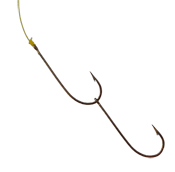

[//]: # (Putting the hook image as the cover looks terrible because it's blown up and stretched, it's stretched to fit the *width* of the banner and then cropped top and bottom so most of it is missing)

[The previous adventuring party](/sunless-citadel-character-hooks-rescue-mission) presumably wanted [the apple](sunless-citadel-character-hooks-tasting-the-fruit-of-the-tree).
(We could say that [they just wanted to start a war with the goblins](/sunless-citadel-adventure-synopsis#durbuluks-raided-road) and didn't care about the apple, but we'll get to that later. Right now, we've only talked about two hooks; we shouldn't introduce the idea of [fighting the goblins being worth doing for its own sake](/sunless-citadel-character-hooks-tasting-the-fruit-of-the-tree#simple-goblin-slaying-possible-motivation) unless we're prepared to expand on that into a proper hook for the PCs.)

Did they have someone particular they wanted to heal? That would be...awkward. That makes it seem like healing those people is part of the adventure. And that wouldn't work, because the people out in the real world don't care about those NPCs.

The standard reference here is the very embedable scene from Pixar's Up.
`youtube:https://www.youtube.com/watch?v=F2bk_9T482g`
The sequence immediately establishes who the characters are and why you should care.

Imagine if, instead, the main characters met Carl, and Carl gave a speech about how he had a wife named Ellie and they had all these dreams but stuff happened and now he has a quest. And therefore he needs you to get him half a dozen bear pelts. Or something. It doesn't actually matter whether there's any logical connection between the story he just told and the adventure, because nobody is going to care about the story he told in the first place.

It's far easier to get people to care about the main characters than to get them to care about some random NPC in town. Especially since, the way adventures work, the NPC will presumably never appear "on-screen" after the first scene.
Using someone with a prior personal connection to the PCs helps, but the best solution is to give ailments to the main characters themselves --- that way the problem is always on-screen.

So the previous adventuring party wasn't trying to heal anyone in particular...unless maybe themselves.

But they were probably after the apple, right? If we're using both hooks, then the apple is the center of the story. Rather than give them some completely different reason, their original reason for delving into the Citadel was the same as the reason the PCs are doing it.

But [the apple only auctions for 50gp](/sunless-citadel-character-hooks-tasting-the-fruit-of-the-tree). We could go back and forth over exactly how much money 50gp is in this world, but the fact is that [Kerowyn Hucrele has access to 2,000gp and thinks her kids' lives are worth about that much](/sunless-citadel-character-hooks-rescue-mission). It's hard to picture her kids risking their lives over 50gp.

We talked about giving the PCs ailments that they want to be rid of but that don't prevent them from adventuring. But as you probably noticed, that list was very carefully chosen. The Heal spell can also cure someone who has been, say, turned into a chaos beast, but that would prevent adventuring. We need the PCs to be [a very specific level of ailing](http://www.shamusyoung.com/twentysidedtale/?p=615) --- the problem has to be crippling enough that they couldn't live a normal life, but not so crippling that it prevents the story. That kind of contrivance is fine for main characters --- crazy things happen to main characters, that's why the story is about them --- but it's something else entirely to give that to four side cahracters. We could get away with that for *one*, maybe. If it's one of the siblings, then that gives us the other sibling coming along, too. But what about the other two adventurers?

...really...the apple is worth a lot more than 50gp, right? It sold for 50gp because it was this weird unknown magical thing and nobody knew for sure what it could heal, or if it had nasty side effects, or what. But this thing is incredibly powerful. Rich people exist in the world. Kerowyn Hucrele is willing to pay 1,000gp to get her children back "of good mind and body". The apple can save four people. Shouldn't someone be willing to pay at least as much?

How much *is* the apple worth?
One obvious reference point is a staff with four charges remaining. Charged magic items have their prices prorated based on the number of charges remaining --- Belak's wand of Entangle is an example. A fully-charged wand of Entangle, with 50 charges, would sell for 375gp; Belak's wand, with 13 charges, sells for 97.5gp if the PCs capture it whole. (If Belak manages to use any charges before they take him down, the wand sells for correspondingly less.)

If the PCs found a staff of Heal with four charges, that's a sixth-level spell, caster level 11, so it's worth 6\*11\*15\*4 = 3,960gp, sells at half price for 1,980gp.
The apple might be worth a little more, since you don't need to find a first-level adept to use it. Not worth a *lot* more, because at this quantity of money...you can hire an alchemist, who is a first-level adept, for a month for 30gp.

4,000gp is a nice round number. 1,000gp for each Heal. Like any magic item, it sells for half price, 500gp per Heal, because this is not a game about going around finding whoever's willing to pay the most.

Suppose that *last* year, it became clear how valuable the apple really was. They figured out that it could be split into four sections and retain full power, or that it could cure a wider variety of conditions, or both.

Maybe someone cast Detect Magic and noted that it had a strong aura. (The apple probably radiates magic, right? Supernatural creatures don't, but the Gulthias tree isn't exactly a creature, the apple is a bit like a magic item...)

If the lost adventuring party expected to get 2,000gp out of this...that sounds like an amount of money worth risking your life for.

But this causes a problem for us when designing the adventure.

There's about 12,500gp worth of treasure in the Sunless Citadel. That's total, so it's a maximum; the PCs might not get all of it.

[Kerowyn Hucrele's 1,000gp reward for the signet rings](/sunless-citadel-character-hooks-rescue-mission) is still significant in light of that. That's good! The quest reward should be noticeable.

Of course, this means that a big chunk of money either exists or doesn't exist, not based on any actions of the PCs, but based on the out-of-universe consideration of what hook we use. But there's no reason to ever *not* use the rescue-mission hook --- indeed, large parts of the adventure will be very confusing without it, as we'll see --- so we can just assume the reward exists and factor it into the treasure budget for the adventure.

The apple is more problematic. Not if *all* the PCs have a need for a Heal; in that case, we just don't include the apple in the treasure budget and everything is fine.
And if *none* of the PCs need a Heal, then we can just say the summer solstice isn't happening now, so there is no apple. Maybe the lost adventurers were just going on a scouting mission, to capture and interrogate goblins well in advance of the summer. Or they were just looking to start a war against the Durbuluks and didn't care about the apple. If none of the PCs want a Heal, then we can discard that entire hook.

But what if *some* PCs have a need for Heal in their backstory, while other PCs don't and are only interested in the apple for the money?
If possible, we'd like to enable that too. The byplay between the ruthlessly mercenary PCs and the ones with personal reasons might be interesting.
But that gives us a situation where some PCs are effectively starting in a 500gp hole.

We *could* make the apple worth less. The reason a magical staff can command a high price is because it can be passed from hand to hand through multiple merchants until it finds whoever is prepared to pay the highest price. If the apple is perishable --- an undead apple might not be perishable, but it might be perishable if we want it to be --- then it would have to be sold to someone who showed up for the auction, even if nobody who showed up was prepared to pay more than 200gp.
The module implies the apples have been transported far away --- "No samples of either type of apple remain anywhere near Oakhurst." --- but it's never important to the story, so it's easy to change.

But we don't really want to make the apple worth less. It's the center of the entire adventure; it *should* stand out in the treasure.
(And if you think that 2,000gp already doesn't sound like enough treasure to be worth worrying about, that sounds like an argument for making the apple worth more, because *the main quest objective should be worth worrying about*.)

One solution is to manipulate character hooks to result in a 500gp windfall corresponding to getting Healed. Then we do include the apple in the treasure budget and everything works out.

For example, using [the aboleth hook](/sunless-citadel-character-hooks-aboleth-slime). Since the hydration requirement is so vague, we can allow a character to fill it just by carrying some extra water. On the other hand, we could say they use a hydration suit [Sandstorm page 99], which conveniently costs 1,000gp and hence can be sold post-Heal for 500gp.
A first-level character could never normally afford a 1,000gp hydration suit, of course, but we can give it to them for "free" as part of the character's backstory, since they're effectively starting 500gp in the hole for the Heal they'll need. It evens out.

Using [the lost-memory hook](/sunless-citadel-character-hooks-tasting-the-fruit-of-the-tree#pixie-amnesia), a character can trivially recover memories of a lost equipment cache worth 500gp. (Since it's their own equipment, which the player gets to choose as part of writing their character backstory, it's worth full price to them, so that 500gp is in nominal prices.)

Using [a phobia hook](/sunless-citadel-character-hooks-phobias), a character might be able to go back and face a now-conquered fear as a coda to the adventure, recovering some treasure cache or family heirloom worth 500gp, perhaps something they lost shortly before the adventure.

> A panicked creature must *drop anything it holds* and flee at top speed from the source of its fear, as well as any other dangers it encounters, along a random path.
>
> --- <cite>Player's Handbook, page 311</cite>

Alternatively, we could make sure that the characters who don't need the Heal itself do have some immediately pressing need for 500gp. Asking new players to come up with something like that is troublesome, because new players don't have a good intuitive sense of how much 500gp is worth. But this has the obvious advantage that the characters who are in it for the money have something specific that they're after, just like the characters who are in it for the Healing.

