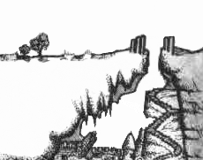

> Player characters who arrive during daylight hours have a good view of the site, which is depicted on the Sunless Citadel Cutaway Map. If they arrive in the darkness of night, the player characters see only what their light sources (and vision capabilities) allow.
>
> --- <cite>The Sunless Citadel, page 4</cite>

> The Old Road passes to the east of a narrow ravine...The ravine runs for several miles in either direction, with an average depth and width of 30 feet. At the point where it most closely intersects the Old Road, it widens to 40 feet. It also plunges much deeper into the earth near the pillars described above.
>
> --- <cite>The Sunless Citadel, pages 4--5</cite>

It's things like this that [made me want to contrive a reason for the PCs to travel by night](/rumors-heard-in-oakhurst#no-reason-to-walk-old-road-by-night). The module keeps making reference to what happens if the PCs travel by night, but never says *why* anyone would ever do that.

What I really want to ask, though, is this: Can the PCs see the roof of the Citadel?

Torchlight won't reach that far. But look at the cutaway. At about...eleven o'clock, sunlight briefly streams in through the ravine to the roof of the Citadel. Sunless it ain't.

  </img>
  </img>

Of course, there will be shadows cast by the pillars, but the pillars aren't a solid wall.

The further-inward portions of the roof where direct sunlight does not reach will still be in deep shadow.

> At the road's closest approach to the cleft, several broken pillars jut from the earth where the ravine widens and opens into something more akin to a deep, but narrow, canyon.
>
> --- <cite>The Sunless Citadel, page 4</cite>

> A ravine is a landform narrower than a canyon and is often the product of streamcutting erosion.
>
> --- <cite>Wikipedia</cite>

> Two of the pillars stand straight, but most of them lean against the sloped earth. Others are broken, and several have apparently fallen into the darkness-shrouded depths. A few similar pillars are visible on the opposite side of the ravine.
>
> --- <cite>The Sunless Citadel, page 5</cite>

("darkness shrouded depths"? It's not nighttime! [Not unless we contrive a reason for the PCs to travel by night.](/rumors-heard-in-oakhurst#no-reason-to-walk-old-road-by-night))

Does it matter if the PCs can see the roof of the Citadel? Well...

> Ventilation: All keyed areas contain an adequate air supply, unless noted otherwise. The air is renewed from countless cracks leading to the upper open cavern and the surface, as well as many miniature tunnels leading to thriving Underdark ecologies. These cracks are individually too small for any but Fine creatures to navigate.
>
> --- <cite>The Sunless Citadel, page 7</cite>

We can assume all cracks are indirect enough that PCs won't see *light* coming out of the Citadel at night. But during the day, they might see *smoke*.

> A large pit in the chamber's center shows evidence of a recent bonfire.
>
> --- <cite>The Sunless Citadel, Area 15</cite>

> A permanent camp of sorts lies north of the wall, complete with a fire ring and several small iron cook pots.
>
> --- <cite>The Sunless Citadel, Area 33</cite>

> ...a much-used fire pit. Battered cooking equipment...
>
> --- <cite>The Sunless Citadel, Areas 36</cite>

But what are the odds they'd happen to be cooking at eleven o'clock, right? Well...according to the text, some fires specifically happen to be burning whenever the PCs show up.

> Several small but smoky bonfires light this wide and high chamber.
>
> --- <cite>The Sunless Citadel, Area 20</cite>

> Several torches mounted in crude wall sconces burn fitfully in this chamber, filling the air with a haze that blurs sight...The haze never builds to suffocating levels, thanks to ventilation provided by many small crevices and cracks in the ceiling and walls.
>
> --- <cite>The Sunless Citadel, Area 39</cite>

FoundryAtropos made a nice map showing the fires in Area 15, Area 33, and Area 20 (Areas 36 are depicted with their fires not currently lit on this map, and for whatever reason you can only barely make out the torches in Area 39).

So if the PCs hang around until eleven o'clock, they'll likely see smoke coming from near the center of the Citadel, as well as slightly northwest of there. Not that they're likely to hang around until eleven o'clock, but they *can* make a semi-survey of the site if they choose to.

Smoke aside, they can certainly see the outline of the roof.

## Darkvision

Now you have beings that see in "black and white". How much dithering is allowed?

