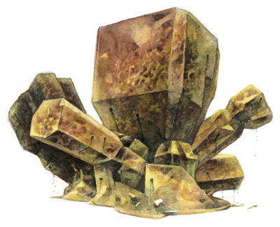
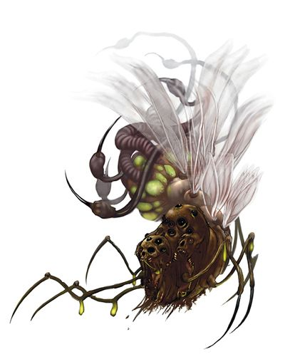

The remaining maladies require some explanation of the terrible monsters that inflict them.
This can double as worldbuilding, setting up obyriths or aboleths or yuan-ti for later. So these are particularly good if any such monsters will feature later in the campaign.

[Draudnus](https://allthetropes.fandom.com/wiki/Alien_Geometries), golothomas, and [ekolids](https://allthetropes.fandom.com/wiki/Horde_of_Alien_Locusts) are each a kind of obyrith. "Obyriths" are the D&D version of [horrorterrors from Beyond](https://allthetropes.fandom.com/wiki/Eldritch_Abomination).

> Those within 60 feet of an obyrith who observe it are subject to madness...The kind of malady and its duration depends on the obyrith...The insanity caused by an obyrith's form of madness ability is permanent in most cases, but can be removed by greater restoration, heal, limited wish, miracle, or wish.
>
> --- <cite>Fiendish Codex I, pages 27--28</cite>

Now you might be wondering why any chump 11th-level cleric can wipe away the mind-shattering revelation of horrorterrors from Beyond with a single spell. The answer is that 11th-level clerics are plenty eldritch themselves.

> As a rule of thumb, characters who are 11th level and higher are "legendary," as are the sorts of creatures they contend with, the major magic items they wield, and the places where they perform their key deeds.
>
> --- <cite>Player's Handbook, page 246</cite>

Yes, 11th-level clerics can heal minds. They can also call actual holier-than-thou [angels](http://www.d20srd.org/srd/monsters/angel.htm#angelAstralDeva) down from the heavens, and the angels [answer](http://www.d20srd.org/srd/spells/planarAlly.htm). 11th-level clerics are kind of a big deal. And that's why 11th-level clerics will definitely not be available to most people --- so while very few people encounter horrorterrors from Beyond, those who do will need to go questing for something like this apple.

Note that a first-level character could not have been *attacked* by an obyrith in their backstory. Any of these obyriths would have easily killed a first-level character in a few seconds if they ever took any interest in the character at all. But merely being near an obyrith while it passes by damages a character's mind.

## Draudnu

(Warning: incoming made-up words.) In the Age Before Ages, the obyriths created countless twisted and terrible creatures out of mortal souls. The greatest practitioner of this obyrith art form who yet lives is Pale Night, called the Mother by her contemporaries. It was a term of honor, at the time --- but no longer. The tanar'ri were created from the souls of humanoids --- humans, elves, and the like --- to serve as tormented slaves of the obyriths. When the obyriths' ancient enemies, the eladrin, invaded, the tanar'ri threw off their chains and opened the gates to the invaders --- only to be slaughtered along with the obyriths.

Pale Night created the draudnus from the bones of eladrin children. Incarnations of spite, draudnus hate tanar'ri above all other creatures, and hunt them endlessly.

> Form of Madness (Su) When a draudnu comes within 60 feet of a creature, that creature must succeed on a DC 20 Will save or believe that something is growing inside it, becoming sickened.
> The sickened condition is permanent until the insanity is cured by greater restoration, heal, miracle, or wish.
>
> --- <cite>Fiendish Codex I, page 24</cite>

Exactly what the character thinks is growing inside them depends on their own preconceptions. Some fixate on the delusional belief that a draudnu is growing inside them, that this is how the creatures reproduce, and that it will soon claw its way out. But a draudnu, unlike other obyriths, causes madness even to those who never know the draudnu is there --- even if the draudnu passes nearby on the other side of a solid stone wall. It might seem less likely that a victim would never know the draudnu was there, but given the draudnus' power and penchant for indiscriminate violence, quite a few of those who suffer its Form of Madness *and survive* are of this latter category.

### Something is growing inside

Tirbanas, xills, and red slaadi all lay eggs in hapless hosts.

> In a parasitic relationship, parasites benefit at the expense of other organisms, the hosts, which are damaged in result. But despite hurting it, parasites try to keep their hosts alive as long as possible, in order to keep on benefiting from them, so parasites rarely kill their hosts.
>
> In a predator-prey relationship, predators feed on a lot of organisms (the prey) throughout their life cycle. Unlike parasite organisms, predators don't try to keep their prey alive, because the purpose of preying on other organisms is to obtain energy as fast as possible.
>
> Finally, between parasitism and predation we find parasitoid organisms: creatures with a parasitic larval stage that develop by feeding on a single host.
>
> In contrast with parasites, parasitoid larvae kill their hosts to complete their life cycle. So in what sense are they different from predators? The answer is that parasitic larvae only need to feed on a single host to reach adulthood. While parasitoid larvae are a parasitic life form, parasitoid adults tend to be herbivores or predators.
>
> Idiobiont [from Greek idio- meaning peculiar] parasitoids paralyze or prevent further development of hosts when laying eggs, so idiobiont larvae have a reliable and immobile source of food at their birth.
>
> Unlike idiobionts, almost all koinobionts are endoparasitic, laying their eggs directly inside the host.
>
> Koinobionts [from Greek koino- meaning defiled, unclean, or unholy, but also meaning general or shared as in the opposite of idio- peculiar, because biologists do like their Greek jokes] allow the host to continue its development while feeding on it. Thus, the parasitic larvae feed on the host while growing inside the host's body without causing it any damage...until the moment the larvae reach adulthood, when they emerge from the body of the host, causing its death.
>
> --- <cite>[All You Need is Biology](https://allyouneedisbiology.wordpress.com/2015/09/27/what-are-parasitoid-insects-and-what-are-they-useful-for/)</cite>

(It's hard to pin down the "genre" of Dungeons & Dragons, but it definitely seems related to real-world entomology --- both heavily feature detached, clinical narration of mind-bogglingly horrifying things.)

#### Tirbana

Tirbanas are more "mundane" than xills or slaadi, and are the most likely to be encountered on the Material Plane.

A tirbana colony descends en masse upon a large herd of animals...though they're just as happy to attack a human village.[Monster Manual V, page 172] Tirbana "drowsers" have the magical ability to put prospective hosts to sleep [Monster Manual V, page 173], allowing their queen to insert her eggs [Monster Manual V, page 176]. Peasant superstition holds that keeping a small animal near you will protect you from tirbana drowsers, and in particular that carrying thirteen toads on your person constitutes an absolute defense. This is actually true.[Player's Handbook page 280]

Although tirbanas can be terrible monsters to peasants, many royal families keep colonies of tirbanas close by --- the worker drones are little more than animalistic beasts [Monster Manual V page 173], but the spawners are intelligent[Monster Manual V page 174] and can be negotiated with.

Tirbana "eyewings" have the unique ability to negate enchantments that ensnare the mind.[Monster Manual V page 172]
(Tirbanas are not immune to the soporific effect of their own drowsers, nor is the effect very precisely targeted, so tirbanas rely on eyewings to keep them awake.)
Tirbana eyewings provide one of the few defenses against an autocracy being simply taken over by magic.
Tirbana drowsers also have the innate ability to detect magic[Monster Manual V page 173], so a friendly tirbana colony is a boon to any government worried about covert magic use.

Negotiating with tirbanas is fairly straightforward. It's easy to learn what tirbana spawners want, because what any tirbana spawner wants is reproduction, for herself and any sisters she may have --- "the continued spread of the tirbana race outweighs any other concern" [Monster Manual V page 177]. As you might guess, appeasing tirbanas is completely unsustainable in the long run --- tirbanas are happy to be given large herd animals as hosts, but if tirbanas are truly given all the hosts they want, on average their population roughly triples every month [Monster Manual V page 176]. Hey, collapsed kingdoms have to come from someplace. You can drive a hard bargain and restrict their reproduction --- tirbana spawners aren't irrational, and being subjugated is better than being put to the sword --- but since they're the ones in charge of keeping a watchful eye out for magic and keeping the palace guards un-enchanted, you run the risk that someone else might make them a better offer...which quickly leads to a race to the bottom, offering the tirbanas more and more.

Drowsers *are* more intelligent than animals (if only just), and have grammatical language. Tirbanas speak their own language, so unless the royal guards speak Tirbana, drowsers are often effectively unsupervised in their magic-detecting duties, given their orders by the spawner (who typically understands Common and Elven when necessary, even if she's not capable of actually vocalizing them). Human mouths are capable of vocalizing enough of the Tirbana language to get by, and the most successful partnerships are with human kingdoms where a large number of humans make a point of learning the tirbana language. (Tirbanas also partner with humans more frequently because humans have shorter lifespans and are more willing to overlook the inevitable disaster.)

If a character bumped into an unsupervised drowser, the startled drowser might have instinctively put them to sleep. Not an uncommon occurrence, and usually harmless --- but if a draudnu happened to pass nearby at the same time, the character would be affected by the draudnu's Form of Madness, even if they were sound asleep at the time.
The character might then fixate on the idea that tirbana eggs were implanted while they were asleep.

#### Xill

[//]: # (The original image link to http://www.lomion.de/cmm/xill.php went down, underscoring the importance of not relying on external anything if you can avoid it.)

Xills are brutal conquerors that walk through the Ethereal Plane.

[//]: # (Why does the image caption work for the tirbana image above but not for the xill image?)

> The Ethereal Plane is a misty, fog-bound dimension that is coexistent with the Material Plane...a collection of swirling mists and colorful fogs. The Material Plane is visible from the Ethereal Plane, but it appears muted and indistinct, its colors blurring into each other and its edges turning fuzzy. Ethereal denizens watch the Material Plane as though viewing it through distorted and frosted glass.
> While it is possible to see into the Material Plane from the Ethereal Plane, the Ethereal Plane is usually invisible to those on the Material Plane...A traveler on the Ethereal Plane is invisible, incorporeal, and utterly silent to someone on the Material Plane.
>
> --- <cite>Dungeon Master's Guide, page 151</cite>

Most people have never seen a xill, but xills are always watching:

> Vision is limited, however, to 60 feet both on the Ethereal Plane and onto the Material Plane. Furthermore, the Material Plane appears as if wrapped in fog, so ethereal observers can't discern precise details such as normal writing. It's easy to discern faces and landmarks, however. Seeing and hearing is otherwise normal, so gaze attacks and sonic attacks and abilities launched from the Material Plane affect ethereal creatures...Ethereal listeners only hear Material Plane sounds that originate up to 60 feet away, but their hearing is otherwise unaffected. Touch, smell, and taste do not reach between the planes.
>
> The Ethereal plane emits its own diffuse light, so ethereal observers do not need torches to see onto the Material Plane, even if it's pitch-black...To viewers on the Ethereal Plane, objects on the Material Plane are foggy, indistinct, and almost translucent. Such objects block line of sight and provide concealment, but not cover. An ethereal observer can't see through a wall on the Material Plane unless he pokes his head through it first. An ethereal character whose eyes are totally within a Material plane object cannot see.
>
> --- <cite>Manual of the Planes, pages 55--56</cite>

Xills are capable of walking between the worlds almost as easily as they walk along the ground. As such, xills provide one of the few means of transporting objects permanently to the Ethereal Plane.

> In general, movement on the Ethereal Plane is unrestrained. Travelers can journey to the center of the earth or high into the sky (though slowly and limited by available food and water). There are, however, permanent objects on the Ethereal Plane that can block movement for ethereal creatures. Ethereal solids are hard to the touch and feel real, even if they have no apparent reality on the coexistent Material Plane...
>
> Ethereal Objects: These objects have been constructed on the Material Plane, then shunted (usually magically) to the Ethereal Plane.
>
> --- <cite>Manual of the Planes, page 56</cite>

Xills can lead beasts of burden carrying building materials, as well as laborers, to the Ethereal Plane to build ethereal walls coexistent with a castle's material walls.
These walls are not, for the most part, intended to keep out wizards. Xills can escort spies and assassins just as easily as laborers. And there's no way to know whether your rivals are already working with xills.

The lucky kingdoms breed and train ether scarabs, animalistic outsiders that live in the Ethereal Plane and can rip holes in reality that other creatures can squeeze through.[Monster Manual II page 94] But ether scarabs are very shy and reclusive --- it's almost impossible to catch one without already having reliable access to the Ethereal Plane. Also, any kingdom known to use ether scarabs will find itself the target of a holy war from everyone who doesn't have them, based on the claim that ether scarabs are the pawns of demons.

The dwarves of the great desert scorn both ether scarabs and xills, relying on ghosts. When a ghost forms, it forms ethereal copies of two to eight objects that it particularly valued in life --- though only if those objects are not in another creature's possession at the time of death. There is no way to predict who will form a ghost, so desert dwarves build great fortresses as community projects. Any desert dwarf who shows interest in architecture is encouraged to think of one particular building (or, in the case of great prodigies, up to eight) as *theirs*, and when a desert dwarf lies on their deathbed, they are formally given the deed to any buildings they name (within reason), provided those buildings are not already the property of a ghost.

If the desert dwarf dies and does not form a ghost, the buildings pass back into receivership; but if they *do* form a ghost, and they form ethereal copies of any buildings, then those buildings are theirs to keep as long as they unlive. Often, the unfinished business that keeps the ghost from its rest is the need to finish the buildings themselves --- grand multi-century projects that are always being refined.

But most kingdoms do not have ether scarabs, and do not want to rely on the fickle whims of fate to give them ghosts. And that keeps xills in business.

Xills like treasure as much as anyone else, but generally deals include intelligent creatures for the xills to use as incubators for their eggs --- usually criminals or "criminals" who were going to be disposed of anyway.

More mundanely, xills prize the warhorses that humans breed. Some xill horse-nomads even implant their eggs into horses when their steeds grow too old to ride and start to falter. This is certainly more acceptable to their human allies, since no intelligent creatures have to die for the xills to be born, but most xills consider those xills to be disgusting perverts. For most xills, the thought of reproducing with a creature of animal intelligence is as revolting as bestiality to a human. The stigma of being born that way never washes off, even though the xill in question obviously wasn't responsible for their own birth; xills born of animals often are forced to leave xill "civilized" society and live as borderline hermits preying on whatever unlucky souls cross their path.

Even more mundanely, xills trade for cold iron weapons.

Although xills do not need food as sustenance, some develop a taste for delicacies anyway. But the more common reason xills need to trade for food is to feed the prisoners incubating their eggs. Xills have been known to dote obsessively on humans carrying their children --- some reports describe the captives living (brief) lives of opulent luxury, pampered due to xill superstitions about effects it will have on their children, similar to real-world human beliefs about playing Mozart for a fetus.

All this results in many wild tales. Just as there is no way for kings to know whether their rivals are working with xills, there's no way for peasants to know whether kings are working with xills. (It doesn't help that most people don't actually know what xills look like, even if they saw one on the Material Plane.) More kings are *rumored* to be working with xills than actually are. And the popular imagination of what those deals entail tends to the lurid.

> Normally your brain paralyzes many of your muscles during the stage of Rapid Eye Movement sleep. This paralysis is called atonia.
> You may experience sleep paralysis if atonia lingers as you wake up from REM sleep; it also may occur if you transition quickly from wakefulness into REM sleep.
> Sleep paralysis may occur together with hallucinations. You may imagine that you see or hear something; you even may think that someone or something is in the room with you.
>
> Across cultures, the strange sensation of sleep paralysis has evoked some vivid descriptions. In 1664 a Dutch physician published a case history of a woman with sleep paralysis. The devil lay upon her and held her down, he wrote.
>
> --- <cite>[Sleep Education](http://sleepeducation.org/news/2009/07/29/sleep-paralysis-the-devil-the-ghost-the-old-hag)</cite>

Superstition holds that xills paralyze people at night, and sometimes that implanted xill eggs are responsible for illness, or that xills are responsible for the disappearance of someone who skipped town. The faint connection to reality is that xills secrete a paralytic venom and lay eggs in paralyzed creatures, like idiobionts.

> Implant (Ex): As a standard action, a xill can lay eggs inside a paralyzed creature. The young emerge about 90 days later, literally devouring the host from inside.
>
> --- <cite>Monster Manual page 260</cite>

But xills are koinobionts, not idiobionts --- the paralysis only lasts a few hours, long enough for the eggs to ensconce themselves, while the young don't emerge for another three months.

A xill would never abandon its children --- instead, xills keep their incubators prisoner, feeding them and keeping them healthy until they inevitably die.

Xills are scrupulously lawful and do not hunt the subjects of their allied kingdoms.
It *is* true that xills have been known to hunt elsewhere --- and there are even "barbaric" xills living on the fringes of xill society who kidnap random people and drag them away. But xills also protect their allied kingdoms from worse monsters --- particularly night hags.

Night hags really do prey on sleeping people the way xills are imagined to.

> Dream Haunting (Su): Night hags can visit the dreams of chaotic or evil individuals by using a special periapt known as a heartstone to become ethereal, then hovering over the creature. Once a hag invades someone's dreams, it rides on the victim's back until dawn. The sleeper suffers from tormenting dreams and takes 1 point of Constitution drain upon awakening. Only another ethereal being can stop these nocturnal intrusions, by confronting and defeating the night hag.
>
> --- <cite>Monster Manual page 194</cite>

A night hag cannot stay on the Ethereal Plane forever, so night hags can be spotted by onlookers when they blink onto the Material Plane for an instant once every sixteen minutes. In theory, the night hag could be attacked in that moment, but a night hag is more than a match for ordinary people.

[//]: # (When Etherealness expires, all affected creatures on the Ethereal Plane return to material existence, regardless of how many other Etherealness spells they're under.)

But night hags do have a weakness: after haunting someone's dreams, they cannot or will not leave them until dawn. The only way a night hag can move during this time is if the victim moves. Night hags and loathe to wake their victims, even to threaten them and force them to carry the night hag to safety, but will do so if in serious danger.

Kobolds, hobgoblins, and duergar routinely make pacts with xills for protection from night hags, but sometimes humans do as well. Because night hags are formidable, this usually means xills escorting allies, but occasionally a brave or foolish xill with magic cold iron weapons will attack a night hag personally. Sometimes, these xills win. Sometimes, [the ungrateful bastards then blame the xill for the tormenting dreams](https://allthetropes.fandom.com/wiki/No_Good_Deed_Goes_Unpunished)...though not to its face, because self-preservation demands being respectful to xills in much the same way that peasants are always polite to the baron no matter what crimes they suspect him of.

Night hags, while disturbing, are rare on the Material Plane --- they hail from the Gray Waste, and they have no ability to travel the planes on their own (though they're cunning enough that quite a few have found their way to the Material Plane). More troubling are fiends of possession.

> Sometimes a fiend with at least 4 Hit Dice and a Charisma score of at least 13 has the supernatural ability to shuck its physical form and take on an incorporeal one that enables it to possess other creatures...
>
> A fiend with the possession ability can move between its body's plane [usually the Abyss] and the Ethereal Plane as often as it likes as a free action. Once a fiend is on the Ethereal Plane, it floats through the world insubstantially, seeking a target to possess. If it moves to a plane other than the Ethereal Plane in this form, it is visible, but appears as a ghostly duplicate of its normal physical form.
>
> --- <cite>Fiendish Codex I, pages 21--22</cite>

Now, any planar scholar will tell you that the Abyss is infinite, so you might wonder why every street corner isn't haunted by demons piled like cordwood in every direction. The answer is that the Material Plane is also infinite --- when a fiend of possession moves to the Ethereal Plane, in almost all cases it appears floating in a vast, empty void, with nothing visible within 60 feet in any direction. Usually, the demon immediately gets bored and leaves.

But sometimes, a fiend of possession does appear near mortals. Fortunately, such a demon cannot simply go on a rampage attacking every mortal it sees.

> No magical attacks cross from the Ethereal Plane to the Material Plane, including force attacks.
>
> --- <cite>Manual of the Planes, page 54</cite>

Even if the fiend stumbled upon an ethereal curtain or other means of leaving the Ethereal Plane, it would be immobile. It would be trapped, in fact, since it can only move between its body's plane (that is, the Abyss) and the Ethereal Plane --- once it is on the Material Plane, on neither its body's plane nor the Ethereal Plane, it cannot go anywhere under its own power.

> A fiend can only move about in its incorporeal state on the plane where its body lies in stasis and the Ethereal Plane. Thus, a demon using this ability while its body is on a layer of the Abyss cannot possess a creature on the Material Plane.
>
> --- <cite>Fiendish Codex I, page 22</cite>

Demons can, however, cause havoc on the Ethereal Plane. Lawful or good ghosts often find themselves targeted by frequent and savage attacks by demons...unless they can plausibly pretend to be chaotic evil, or amuse the demons in some other way.

Moreover, just as a vampire cannot cross running water but can be carried across, a fiend of possession could be carried about on a plane other than the Ethereal. Usually this would be a highly undesirable situation for the chaotic creatures, but that's where the "possession" part comes in.

> To use its possession ability, a fiend must be adjacent to its desired target and in incorporeal form...A fiend in possession of a body becomes part of the victim. It is aware of what is going on around the creature whose body it possesses and can see and hear as well as its victim can. A possessing fiend can, at any time, speak mentally to the creature it possesses in a language that creature can understand, although if the victim isn't very intelligent, its comprehension might be limited.
>
> --- <cite>Fiendish Codex I, page 22</cite>

(An incorporeal ghost has no *physical* body, but a ghost on the Ethereal Plane is not incorporeal anyway.)

A fiend of possession can possess a creature it finds on a the Ethereal Plane and "ride" that host to other planes, including the Material Plane. Demonic possession is not a mind-affecting effect, and undead are not immune --- ghosts included.

> Controller: In the most feared form of possession, a fiend can take a standard action to attempt direct control over its victim's actions...If the possessed creature fails the Will save against control, the fiend has access to all the creature's senses, abilities, skills, feats, and spell knowledge. The fiend now acts as though it is the possessed creature in all respects until control is relinquished or lost...The fiend retains the victim's type and is affected by spells and effects as if it actually were the possessed creature.  
> The possessing fiend automatically maintains control of its victim for a number of rounds equal to 1/2 fiend's HD + fiend's Cha modifier + 1 for each time the fiend has controlled this specific creature before. When the fiend's control lapses, it can attempt to reassert control if it chooses.
>
> --- <cite>Fiendish Codex I, page 23</cite>

Ghosts, unlike most undead, are not evil, but a ghost might be forced to turn on its loved ones by a possessing demon. Ghosts can "manifest" a presence on the Material Plane, but this does not allow them to escape the Ethereal:

> A manifested ghost remains partially on the Ethereal Plane, where is it not incorporeal. A manifested ghost can be attacked by opponents on either the Material Plane or the Ethereal Plane.
>
> --- <cite>Monster Manual page 118</cite>

Of course, only some ghosts are vulnerable to attack by demons.
A ghost *might* have only a Frightful Moan to protect itself, which won't do much good against a demon...but some ghosts have a Corrupting Gaze that blasts demons who approach to possess. The demons have little fear of their incorporeal forms being destroyed, but a ghost's Corrupting Gaze also damages their Charisma. A fiend with a Charisma score below 13 never has the possession ability, so it would be unable to possess the ghost --- and also unable to escape the Ethereal and return to its body --- until it recovered. Some ghosts even have a supernatural Draining Touch that can --- if the ghost knows to try --- drain away the fiend's precious Charisma permanently, leaving the unlucky demon trapped comatose on the Ethereal Plane forever. And there's no way to tell whether a ghost has Draining Touch --- or knows how to use it --- just by looking. So some demons seek easier prey.

Ethereal filchers, ethereal marauders, phase spiders, and thought eaters have three things in common: Int 7, the native ability to enter the Ethereal Plane, and very...*functional* names. These three things are all related.

The names "ethereal filcher", "ethereal marauder", "phase spider", and "thought eater" were given to them by discoverers. They do not have names they call themselves, because none of them speak, even among themselves, though they understand the Common tongue if it is spoken to them [Monster Manual page 7].
They communicate with each other via possessing fiends hopping from body to body; from their perspective, this is just the way the world is, this is the way things have always been. Their average Intelligence places them alongside the bottom 16.2% of humans, which isn't especially stupid but does give the demons that much more leeway to manipulate them.

Thus, although ethereal marauders and phase spiders are never chaotic nor evil, and ethereal filchers and thought eaters rarely are, their societies are disorganized and mostly based around murder and robbery. Of course, if a demon starts actively controlling one of them, their actions will become far more depraved (and they'll probably wise up very quickly on the whole "demons are very very bad" concept, but by then it is too late).

Ultimately, though, a demon controlling an ethereal marauder isn't much more threatening than an ethereal marauder usually is. But a fiend of possession can change to a different strategy at any time.

> Transformer: This demon wants to use its host to gain a foothold on the Material Plane. To that end, it utilizes its considerable power to transform all or part of any creature it possesses into its own demonic shape. This process usually takes considerable time and effort on the part of the demon, but the overall effect is devastating...Complete transformation takes at least four days (one for each quarter of the host's body). Once a victim has been completely transformed, the demon has essentially taken the host's place. At that point, the demon has access to all the powers and abilities it normally possesses. The victim is trapped within the demon --- effectively functioning as a rider in the demon's body --- and can neither communicate nor exercise any power.
>
> Transformer demons seldom, if ever, leave their host bodies willingly. Killing a transformer demon slays the host...
>
> --- <cite>Fiendish Codex I, page 24</cite>

And that is how we occasionally get demons wandering the Material Plane.

But it could be worse.

> Ethereal oozes are creatures native to the Ethereal Plane that hunt and feed off material beings. Their terrifying, seemingly unstoppable attacks have given rise to countless myths about the wrath of gods and stories of mysterious disappearances.
>
> --- <cite>Fiend Folio page 63</cite>

An ethereal ooze cannot harm creatures on the Material Plane, but it can forcibly drag them to the Ethereal Plane --- where it devours them.

An ethereal ooze is bad enough on its own, but it is, thankfully, completely unintelligent. A region known to be haunted by an ethereal ooze can simply be avoided --- treating the ooze like a living natural disaster --- or, if it comes near people, it can be carefully "led" away, since it moves slowly and predictably.

Traveling dream dwarves maintain maps of the locations of ethereal oozes for anyone who cares to look --- ethereal creatures can hide from dream dwarves' Dream Sight inside material objects, but ethereal oozes don't even think to try.

> Dream Sight (Su): A dream dwarf can see ethereal creatures as easily as she sees material creatures and objects. A dream dwarf can easily distinguish between ethereal creatures and material ones, because ethereal creatures appear translucent and indistinct.
>
> --- <cite>Races of Stone, page 89</cite>

But since demonic possession is not a mind-affecting effect, it works on nonintelligent targets --- in fact, the chances of an ooze succeeding on its Will save are slim. And the demon can use the ethereal ooze much more effectively, hiding inside material objects and ambushing particular targets. Most targets it attacks will die --- the process of dragging a target to the Ethereal Plane shuttles them physically through the ethereal ooze, which both physically crushes them and sears them with acid in the process --- but while the demon usually enjoys the carnage, they doesn't mean they won't take advantage of the situation if by chance someone survives. The victim, once on the Ethereal Plane, can be possessed by the demon --- abandoning the ethereal ooze means it will pursue the closest creature, but since the ooze is not invisible on the Ethereal Plane, it can be escaped via the well-known "leisurely stroll" technique. The victim is usually not in a position to resist demonic possession --- but is usually also not able to leave the Ethereal Plane. Unless, of course, they make a deal with a xill.
This is why xills have their unfortunate tendency to murder anyone who shows up claiming to have been stranded on the Ethereal Plane by a magical accident: xills assume any such person to be a demonic pawn.

But it could be worse.

In fact, it *is* worse. Because the Ethereal Plane is also populated by ether scarabs --- small, shy, inoffensive creatures that just happen to be able to rip holes in reality.

An ether scarab is relatively useless to a demon as a way to get the the Material Plane --- an ether scarab can rip a hole from the Ethereal Plane to the corresponding location on the Material Plane, but after passing through, the demon cannot move about, so it's stuck in the body of a beetle the size of a housecat, which is not something most demons consider a good time.

But if, instead, a demon forces an ether scarab to rip a hole in reailty from the Ethereal Plane to the Abyss...well, then it reaches a random location in the Infinite Layers of the Abyss, probably nowhere near the possessing fiend's body. But something *else* can come through. Whatever happens to be there, Large or smaller, and able and willing to jump through the planar rip before it closes in 1d4+1 rounds. And the possessed ether scarab can immediately let them into the Material Plane --- assuming the poor beetle isn't instantly killed by their mere presence. Some of the worst demons do that, like golothomas.

Often, nothing comes. Sometimes it's something harmless. But sooner or later, a possessed ether scarab will open a portal to a part of the Abyss where unimaginably terrible creatures dwell. It is inevitable.

In the meantime, the sightings of ether scarabs letting various minor demons into the Material Plane leads to drives to exterminate the beetles once and for all. Which is...practically impossible, since they live on the Ethereal Plane and don't need to eat, but it serves as a handy rallying cry for butchering people who have cool things you don't have. Waging war on a kingdom that uses ether scarabs almost requires the aid of xills, but the xills will be all for it, since wiping out ether scarabs reduces the alternatives to making deals with xills, and thus increases the xill's negotiating leverage.

But what if a xill runs into a demon in the Ethereal Plane?

Xill communities stockpile magic cold iron weapons, but it's very difficult to track someone down in the Ethereal Plane. Mostly, you just run across someone unexpectedly and have to make a snap decision. And if that someone is a powerful demon, a xill's snap decision is often to flee to the Material Plane.

Draudnus certainly qualify to be fiends of possession. And unlike other obyriths, a draudnu doesn't need to be observed to disturb minds.

So a character living in a kingdom known or rumored to cut deals with xills wakes in the middle of the night to see a xill standing over them...and since they're already affected by draudnu madness in that moment, they immediately become convinced they're carrying xill young.

#### Red slaad

After all the complications explaining tirbanas and xills and their place in society, red slaadi are comparatively straightforward: they have no place in society whatsoever.

> Weakest of the slaadi, the reds wander about individually, often establishing secret lairs on other planes. Most seek to escape from the other more powerful and sometimes cruel slaadi.
>
> --- <cite>Monster Manual page 229</cite>

Slaadi are rarely found on the Material Plane, but unlike tirbanas or xills, slaadi are likely to abandon the host alive.

> Often the slaad implants an unconscious or otherwise helpless creature (which gets no saving throw). The egg gestates for one week before hatching into a blue slaad that eats its way out, killing the host.
>
> --- <cite>Monster Manual page 229</cite>

Red slaadi have no native ability to render people unconscious, except by knocking them out just as a human can. But a red slaad can also implant an egg with a claw attack. A red slaad's claw attack deals 1d4+2 points of damage...which is technically survivable. A red slaad might idly bat a character aside without thinking twice about it, never realizing how the character would obsess on that moment later.

A character might get scratched by a red slaad and come within 60 feet of a draudnu sometime later, and only then become convinced they've been implanted with an egg.

#### No cure for draudnu delusion

Parasitic eggs, whether from a tirbana, xill, or slaad, can be easily killed by a Remove Disease spell from a 3rd-level Healer. We'll talk more about demographics when we get to talking about Oakhurst, but a 3rd-level Healer isn't *that* hard to find, though they are rare enough that their services are expensive --- one Remove Disease costs as much as ten healthy oxen.
Xill or slaad eggs can also be removed much more affordably with a mundane DC 25 Heal check, though it's a painful procedure and dangerous in its own right, dealing 1d4 points of damage with each attempt.

But no matter what care they receive, a character suffering from draudnu madness continues to believe that something is growing inside them. They may have insisted on repeating Heal checks almost to the point of killing themselves, convinced that each attempt was failing. They may have denounced a "Healer" as a charlatan, but upon finding another Healer they got the same result. (For 150gp per attempt, so if a character really did try this, they must have had a supply of money at first, though they're now spent almost all of it.)

A character suffering from draudnu madness doesn't want to be cured of their madness, because they don't believe it *is* madness. Rather, they hope that an apple that can cure *anything* might succeed where other attempts failed. They might postulate that what is growing inside them has enough psychic power to protect itself against a low-level Healer. In fact, there is one parasite for which that is *true*. Mind flayers reproduce by inserting tadpoles into the ears of humanoids. The tadpole grows as it devours its host's brain, until its tentacles emerge from the skull and it puppets the body. Mind flayer tadpoles are immune to Remove Disease.

When confronted with other evidence, such as the fact that it's been six months and *surely a growing tirbana would have killed them by now*, they may decide that obviously *this* tirbana is different. Or they may attribute their survival to elaborate (nonfunctional) rituals they perform daily.

One complication is that it might actually be pretty hard to complete a first-level adventure while sickened.
[A sickened character takes a -2 penalty on all attack rolls, weapon damage rolls, saving throws, skill checks, and ability checks.](http://www.d20srd.org/srd/conditionSummary.htm#sickened)
At first level, that's pretty serious, possibly too much for a character to still be effective in the adventure, unless they're a pure spellcaster. But if we're postulating that a character had the bad luck to run across a draudnu, it's perfectly fair to also assume they had the good luck to already receive some help from a 5th-level cleric.

> Remove nausea restores to health a creature who is nauseated or sickened. Remove nausea cures only the nausea or sickening effect, not disease, poison, or any other effects [such as the delusional belief that something is growing inside them].
>
> --- <cite>Book of Exalted Deeds, page 105</cite>

The sickened condition caused by draudnu madness "is permanent until the insanity is cured". That's a statement of duration; the sickening lasts as long as the insanity lasts. It doesn't mean that the sickening has any special protection against being removed by magic that can normally remove the sickened condition. Of course, the spell cures only the sickening effect, not the delusional belief.

## Golothoma

A golothoma has no mouth. It feeds by absorbing flesh through its writhing shadow, which moves independently of the golothoma and devours every living creature within fifteen feet.

A golothoma isn't something you can really encounter and live to tell the tale, but it might be briefly glimpsed through an ephemeral portal to the Plane of Shadow.
(A character on the Ethereal Plane could see a golothoma on the Material Plane, but since golothomas are associated with the Plane of Shadow, it seems a shame not to use that.)

As befits a more powerful obyrith, horror crosses over into a...fascination.

> Form of Madness (Su) A creature within 60 feet that observes a golothoma must attempt a DC 27 Will save. Failure indicates the victim develops an unhealthy obsession with shadows and shadowy illumination.
Whenever the creature is in darkness or bright illumination, its distraction and discomfort sickens it, imposing
a -2 penalty on attack rolls, weapon damage rolls, saving throws, skill checks, and ability checks. In addition, it must make a DC 15 Concentration check to cast spells.
> Its reflexive desire to accept shadow causes it to take a -4 penalty on saving throws against spells of the shadow subschool...Shadows and other creatures from the Plane of Shadow gain a +4 bonus on attack rolls against such a creature.
>
> --- <cite>Elder Evils pages 118--119</cite>

> Mal: That poor bastard you took off my ship. He looked right into the face of it --- was made to stare.
>
> Harken: "It"?
>
> Mal: That darkness. Kind of darkness you can't even imagine. Blacker than the space it moves through.
>
> Harken: Very poetic.
>
> Mal: They made him watch. He probably tried to turn away, and they wouldn't let him. You call him a survivor? He's not. A man comes up against that kind of will, the only way to deal with it, I suspect, is to become it. He's following the only course left to him. First, he'll try to make himself look like one. Cut on himself, desecrate his flesh and then, he'll start acting like one.
>
> --- <cite>Bushwhacked</cite>

Remove Nausea is of little use in this case, since it only works instantaneously --- unlike draudnu madness, which sickens you once permanently, golothoma madness sickens you every time you find yourself in darkness or bright illumination.

Golothoma madness can be a good way for new players to learn the rules about light sources. You definitely want only one such character in a party, because more would be too much of a headache. They need to have a light source close enough to see where they're putting their feet, but not so close that it sickens them.

## Ekolid

An ekolid is an insectoid demon. Ekolids are the least powerful known obyriths. After exotica like the draudnu and golothoma, ekolid madness sounds almost like a mundane traumatic flashback. Except, it causes formication.

> Form of Madness (Su) A creature within 60 feet that observes an ekolid must attempt a DC 14 Will save. Failure indicates the creature begins hallucinating that tiny biting insects are infesting its hair, skin, and clothes. The victim takes a -1 penalty on skill checks and must succeed on a DC 10 Concentration check in order to cast any spells.
>
> --- <cite>Fiendish Codex I, page 38</cite>

Ekolid madness is usually minor enough to live with for the duration of the adventure.

Unlike draudnu madness, ekolid madness does not cause delusions, only hallucinations. The character may have initially torn up their flesh in a desperate struggle to find and remove the insects, but by the time the adventure starts, they know the problem is in their head.

Ekolids reproduce *very quickly*. Like tirbanas, xills and slaadi, they implant eggs in other creatures, but the eggs hatch in just a few *seconds*, and grow to adulthood in a few hours. Any ekolid that found its way to the Material Plane would soon consume everything for miles around.

However, an ekolid fiend of possession might be physically trapped while its spirit wanders independent of its body, possessing unlucky passersby and warping their bodies to resemble the ekolid (but lacking its power). Ekolids do not actually *need* to eat, so an ekolid could remain trapped somewhere for a long time.

(The "trapped fiend of possession" angle could also explain surviving an encounter with a golothoma --- golothomas can burrow through earth, but not solid stone, and a golothoma drips shadowy acid but this acid harms only creatures, not objects. But since golothomas are associated with the Plane of Shadow, it seems a shame not to use that.)

Of course, anyone transformed physically into an ekolid would have to be killed quickly to prevent the ekolid from spawning.

## For DMs

If a PC has golothoma madness, it would be good to come up with an expanded role for the unexplained shadow late in The Sunless Citadel.

