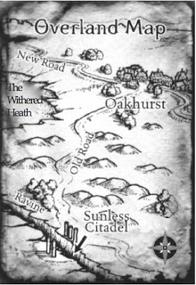

The Old Road does a good job of gradually changing the tone as the party approaches the dungeon.

> The overgrown Old Road winds through rocky downs, near stands of old-growth oak, and past 1d4 abandoned farm shacks. The lonely road is empty of all travelers except for the PCs.
>
> --- <cite>The Sunless Citadel, page 4</cite>

Desolate. Recall that the Old Road "fell into disuse because of goblin banditry." [The Sunless Citadel, page 3] It used to be busier.

> The Old Road also skirts the Ashen Plain, a lifeless land.
>
> --- <cite>The Sunless Citadel, page 3</cite>

Going by the map, to the east (the PCs' left) are always rocky downs. To the west (the PCs' right) are first the Ashen Plain, then rocky downs, and finally stands of old-growth oak.

The Old Road was built, presumably, by the traditional fantasy don't-call-them-Roman precursor empire.

> ...the network of Roman roads covered a distance of over 400,000 kilometers, with more than 120,000 kilometers of this being of the type known as public roads. Spreading across the Romans' vast empire from Great Britain in the north to Morocco in the south, and from Portugal in the west to Iraq in the East, they allowed people and goods to travel quickly from one part of the empire to another.
The Romans classified their roads into several types. The most important of these were the viae publicae (public roads), followed by the viae militares (military roads), then the actus (local roads), and finally the privatae (private roads). The first of these were the widest, and reached up to 12 meters (39.37 ft.) in width.
>
> How did they create this infrastructure that has withstood the passing of time better than most its modern counterparts?
Roman roads consisted of three layers --- a foundation layer on the bottom, a middle layer, and a surface layer on the top. The foundation layer often consisted of stones or earth. Other materials used to form this layer included: rough gravel, crushed bricks, clay material, and even piles of wood when roads were being built over swampy areas. The following layer would be composed of softer materials such as sand or fine gravel. This layer may have been formed by several successive layers. Finally, the surface was made using gravel, which was occasionally mixed with lime. For more prominent areas, such as those close to cities, roads were made more impressive by having the surface layer built using blocks of stone (which depended on the local material available, and may have consisted of volcanic tuff, limestone, basalt, etc.) or cobbles. The center of the road sloped to the sides to allow water to drain off the surface into drainage ditches.
>
> --- <cite>[Built to Last: Craftsmanship Enabled Roman Roads to Withstand the Passage of Time](https://www.ancient-origins.net/history/built-last-craftsmanship-enabled-roman-roads-withstand-passage-time-007523)</cite>

In the olden days, the Old Road would have been patrolled by the don't-call-them-Roman legions, encouraging trade; but the empire fell long ago. The Old Road remained in use for a time, but due to goblin predations, even that has stopped. Even the farm shacks are aband--- uh, actually, why are the farm shacks abandoned?

Seriously, why are the farm shacks abandoned? Were they abandoned due to the Durbuluks' predations, or more recently, due to twig blight attacks? [The rumor earlier said "Cattle herders don't graze their stock too far afield these days."](/rumors-heard-in-oakhurst) That doesn't seem to imply they're picking up and running away; if anything, the fact of mentioning keeping the livestock close and *not* mentioning emigration implies that nobody is leaving (yet).

Knowing *when* the farm shacks were abandoned makes a difference in describing them, if the PCs approach them. Then again, the PCs probably won't approach them, which makes me wonder why they're even here. Normally, if there just happened to be an abandoned farm right next to a dungeon, it would seem like an obvious basecamp for the PCs. (With the disadvantage of being an *obvious* basecamp, so pursuing monsters might look for them there.) But as we discussed, Oakhurst is very, very close. Close enough that the PCs never have to spend the night outside Oakhurst. So...?

We *do* have a potential use for a farm shack, actually. The underlying difficulty we had when arranging the twig blight ambush is that we want the *initial* distance traveled --- on the first leg of the journey, when the PCs encounter the twig blights --- to be longer than subsequent trips. That is, we want later trips to be short, to facilitate returning to rest, but the first trip to be long, to facilitate the twig blight ambush. We can do that just by giving the PCs a reasonably-secure rest stop closer to the dungeon. A farm shack would do nicely.

But the farm needn't be abandoned. Indeed, actual travelers would be more likely to stay the night in peasants' homes than in inns. A single traveler might even be invited into the farmer's bed --- bed-sharing wasn't such a big deal in medieval Christendom. (Four travelers, however, will have to sleep in the barn.)

Lodging as described in the Player's Handbook already kind of sounds like an "inn" is something improvised in a peasant's home:

> 2sp Poor accommodations at an inn amount to a place on the floor near the hearth, plus the use of a blanket if the innkeeper likes you and you're not worried about fleas.
>
> 5sp Common accommodations consist of a place on a raised, heated floor, the use of a blanket and a pillow, and the presence of a higher class of company.
>
> --- <cite>Player's Handbook page 131</cite>

With as heavily armed as PCs tend to be, they sort of go completely around the scale and trust isn't an issue --- if they were bandits, they're clearly capable of taking whatever they want anyway, so it doesn't matter whether you invite them into your home. Of course, particularly rag-tag bands of misfits may get appropriate reactions just as they do in town. And if we want to play up the vampire history in this area (though [we probably don't, since it would create expectations of facing an actual vampire](http://elevenfootpole.blogspot.com/2009/05/foreshadowing-at-minotaur-gate.html)), we can draw their attention to the fact that local custom never actually invites anyone inside anywhere.

If the PCs are going to stay at somebody's farm, we can take the opportunity to engage them some more, especially if they rushed through Oakhurst without asking a lot of questions.

> There were people to meet who weren't directly related to your main goal. You'd run into regular people who would tell you stories that would help you understand how this world worked.
>
> Something like:
>
> John Q. Peasant:
>
> > At first the plague seemed like a lucky break. Before that, the only place that would hire Humans was the refueling station, and that's hazardous work. But then the plague hit and suddenly there were lots of jobs open and everyone wanted to hire me because I'm immune."
>
> (Looks down, rubs hand on back of neck awkwardly.)
>
> > But now? Nobody's coming to the station these days, and my Turian buddies won't visit me anymore. They won't even talk to me. I dunno. This job won't do me much good if the whole colony dies out. I wish things could go back to the way they were.
>
> And then maybe he'd ask you to grab [some bullshit item] from [place where you're already going] for him. When the quest was done, he'd give you a picture of how life on the station has changed because of your actions, or what people think of it.
>
> The point of the quest wasn't to get you to fetch the quest item, the point was to give you a reason to talk to this peasant before and after your adventure. This would put your actions into a more local context. In just a few lines of dialog it gives you a sense of how the culture around here works, what daily life is like, and gives you a frame of reference for how Humans are doing compared to other races. Without these quests, you might assume everyone feels the same way about the council, or other races, or Spectres, or Shepard. These moments give us different viewpoints, which make the world seem larger and more complex. It puts a personal face on a tragedy and maybe even helps build a little emotional connection. The quest reward was just a little incentive to seek out other people to talk to.
>
> --- <cite>[The Importance of Peasants](https://www.shamusyoung.com/twentysidedtale/?p=28980)</cite>

No Gather Information check to hear about cattle herders finding cattle pierced by dozens of needlelike claws? No problem! Here's a cattle herder right here. I'll call him Othic, after the horse-breeder in Of Sound Mind.

The farmhouse is also a potential source of small cute children for twig blights to menace the next time the PCs stop by. Players' *fear* of twig blights isn't likely to last past, say, the second encounter with them, since it'll become obvious that they just aren't much of a threat. But we can transition to making players *hate* the little horrors.

We could also build up the goblins further, if we wanted. The Durbuluks aren't organized enough to actually set up taxation, but they can raid the countryside. "Durbuluks? They come through here every moon or so, taking whatever they please. 'Course, some folks stand up to 'em. If one o' them goblins is fool enough to let hisself get caught alone." (shifty look) "No' tha' I would know anythin' abou' tha'."

Of course, any such buildup of the goblins wouldn't actually be consistent with what the module has to tell us. Timeline problems again. For now, let's talk about the ravine the party finally arrives at.

