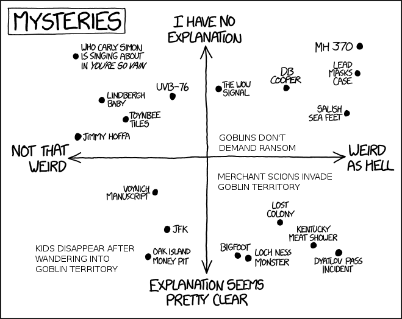

> Contracted: Another party of adventurers, locally based, delved into the Sunless Citadel a month past. They were never seen again.
>
> --- <cite>The Sunless Citadel, page 3</cite>

Kerowyn Hucrele, the mother of two of them, offers a reward for the safe return of her children, which happens to be 250 gp times the number of characters in the party, per child.
Kerowyn Hucrele offers half the reward for just their signet rings.

It's interesting that here the module explicitly bends reality according to the players, something it rarely does. If you only have two players, the reward is 500 gp per child; if you have six players, the reward is 1,500gp per child.

The treasure in the dungeon itself is *not* scaled to the number of players, so Kerowyn Hucrele's reward will be relatively trivial for two players, but very significant for six players. I don't really know what the thought process was here.

It's also not entirely clear whether this was supposed to be an [Excuse Plot] or an invitation to investigate.
Was it supposed to be a mystery what happened to the adventurers?

###  The Durbuluks are not a secret

The Oakhurstians know that the Durbuluks live in the Citadel, right? I mean, why wouldn't they?
As [we talked about before](/sunless-citadel-adventure-synopsis#durbuluks-raided-road), the goblins have had a big impact on Oakhurst.

For the Oakhurstians to *not* know the goblins are in the Citadel would require three consecutive unexplained contrivances:

1. The goblins carried on their entire campaign of banditry without anyone finding out where they were sallying forth from, BUT:
1. The previous party of adventurers found out their location after the fact, BUT:
1. They didn't bother to tell anyone else before they left.

None of these is impossible to justify, but you'd need a good explanation.

So the Oakhurstians know that the adventurers marched straight into the Durbuluk stronghold. And capturing humans for ransom isn't unusual behavior for the Durbuluks.

> The goblins in each [Area 36] are all 90% likely to inflict subdual damage with their saps when encountered by the PCs.
> If the goblins can render one or more PCs unconscious with subdual damage, they'll transfer them to the goblin stockade, locking victims into manacles there. At the same time, they'll take the captured equipment and deliver it to the goblin chief in area 41.
>
> If PCs cannot free themselves, the goblins eventually ransom lucky heroes back to concerned citizens in Oakhurst, though with no equipment or funds.
>
> --- <cite>The Sunless Citadel, page 20</cite>

This makes perfect sense. The goblins trade peacefully with humans when there's profit in it for them, but they also won't hesitate to beat and rob anyone foolish enough to wander into their territory, and ransom them back to other humans for an additional profit.

A couple of young idiots suffering from affluenza wandered into the known territory of known kidnappers and haven't been seen since. What could *possibly* have happened to them?

And in this case, the obvious explanation is in fact correct: the Hucreles *were* captured by goblins. It's not at all clear from the text whether the Oakhurstians know this or will say so if the PCs bother to ask. I can't immediately think of a reason why they *wouldn't* know, nor why they wouldn't say. Indeed, it seems like Kerowyn Hucrele's original job ad ought to be pretty explicit that she's looking to hire goblin slayers. Or hostage negotiators.

The real mystery is why the goblins *haven't*, in the entire *month* since the Hucreles disappeared, made any ransom demands...and of course the most obvious explanation for *that* is that the adventurers were killed, not captured. As a general rule, if someone went into a dark hole a month ago and hasn't been seen since, that person is *dead*. Which raises a question: are the players supposed to anticipate that this is a shaggy-dog quest?

In the horror genre, if the protagonist gets a mission to rescue some people who went into Terrorville, you already pretty much expect that the heroes won't be able to rescue any of the missing people (except *maybe* one Final Girl) and that the best they can hope for is to escape the same fate. You further expect that the viewpoint characters are going to come face to face with the gruesome fates that befell the original party...one...by...one. And that's what happens in the Sunless Citadel.

And make no mistake, we *want* the players to more-or-less suspect this quest is doomed. Not the characters, but the players. This outcome need not be a huge letdown, *provided* you can foreshadow that this is the inevitable result.

So, yes, I submit that we absolutely want the players to suspect from the outset that the rescue mission will fail.

Avoiding disappointment is the less important of two reasons the Hucrele children have been missing for a month. The more important reason is to encourage the fragile first-level PCs to retreat and rest --- that was the point of putting Oakhurst so close to the dungeon --- and they might feel under too much time pressure if they were under a quasi-deadline of "people who have been missing more than forty-eight hours won't be found".

### Kerowyn Hucrele

The text doesn't have much in the way of roleplaying notes on Kerowyn Hucrele.  
Since she's the impetus for the adventure, her characterization needs to be defined backward from the needs of the adventure.  
Given that it seems obvious her children are dead, one obvious move is to play her as desperate and grasping at straws.

*But*...she's also interested in getting those signet rings back. Not quite as much as she's interested in getting her children back, but she *is* willing to pay as much for two signet rings as for one hale and healthy child.

[Mind you, signet rings, serving as signatures, are important to a merchant house.](https://www.thehistorypress.co.uk/articles/a-brief-history-of-signet-rings/) Wouldn't want the signet rings to fall into the wrong hands and get used to seal a fraudulent contract, like the de'Arnise signet ring. But still. Mark that, and then look at her actions in light of the idea that she presumably knows the goblins, serial kidnappers, have her children. We don't know how much goblins usually ransom captives for, but consider that the *entire* liquid wealth of the Durbuluk tribe totals 808.6 gold pieces. (Later we'll get into the treasure roster for this adventure and why a treasure roster is a useful thing to make.)

It's awkward to talk about how big the reward is since it depends on the out-of-universe fact of the number of players, but assuming a party of four, Kerowyn Hucrele is willing to pay 2,000 gold pieces for the safe return of her children. But there's no mention of negotiating with…you know…the goblins. She is however willing to pay people to massacre the goblins.

This is not a desperate woman. Kerowyn Hucrele knows what she's doing. Never pay one red cent of ransom. No one messes with the Hucreles and gets away with it.

And that gives us our characterization, at least enough for her to interact with the PCs. Calculating. Ruthless.

And when you put it like *that*, this also tells us her instructions to the PCs: she *doesn't* want them to attempt to negotiate, because the goblins won't know to threaten Talgen and Sharwyn if they don't know what the PCs want. She wants them to go down there and kill every goblin who stands in their way without a word.

If it's clear from the outset that that's the plan, then the PCs are already on that trajectory when they hit the goblin gate. That neatly solves [our problem of motivating the conflict with the goblins](https://preparetocast.wordpress.com/2018/11/25/sunless-citadel-adventure-synopsis/).

So this is all good, but we should review the exact wording that the module says to hand out to players, because I think it needs to change.

> ...return the gold signet rings worn by the missing brother and sister...reward of 125 gp per signet ring, per PC. If the PCs bring back the Hucreles in good shape (of good mind and body), she offers to double the reward.
>
> --- <cite>The Sunless Citadel, page 3</cite>

Okay, but...what if the PCs bring back the Hucreles in good shape (of good mind and body), but don't bring back the signet rings?

I mean. We wouldn't expect the Hucreles to still *have* the signet rings, right? The rings are made of gold. And we expect that her missing children have been captured by goblins.

> They are not above waylaying travelers on the road or in forests and stripping them of all possessions, up to and including the clothes on their backs.
>
> --- <cite>Monster Manual page 133, "Goblin"</cite>

That doesn't really sound like they're going to let the Hucreles hold onto those signet rings out of sympathy for their sentimental value.

So...what if the PCs find the Hucreles, but not the signet rings? The call doesn't really account for that possibility. (Technically, by the terms of the contract, Kerowyn Hucrele could legally argue that she doesn't owe the PCs anything, because they brought back zero signet rings, and doubling zero is still zero.)

I certainly don't mean that players will actually ask this question. Players will correctly figure that there's no point in paying any attention to the reward, only to the objective. The reward will be whatever the reward will be.

But the reward as stated only makes sense if it is *impossible* to recover the Hucreles without recovering the signet rings. That is, if both Hucreles are either dead or somehow still have their signet rings. This is, in fact, true --- Talgen is dead, and Sharwyn still has her signet ring --- so I can see why the module author didn't think twice about writing it that way. But the in-universe characters don't know that.

We want the players to have some idea that the quest is doomed, but we don't want them to get that idea *this* way --- that makes it look like Kerowyn Hucrele knows more than she's saying. With Kerowyn Hucrele already coming off as calculating and ruthless, we don't want her to seem more sinister than she is --- we don't want the players to get suspicious about the basic premise of the quest.

If we peg the maximum prospective reward as 2,000gp (assuming four PCs), then really Kerowyn Hucrele is offering separate rewards for her signet rings and her children --- 500gp per signet ring and 500gp per child. So when we said she was "willing to pay as much for two signet rings as for one hale and healthy child," that's understating the case. One signet ring is worth as much as one child. The players may take that as they will.

> Kerowyn Hucrele, of the Hucrele merchant family, has put out a call for adventurers. When you arrive, she explains that her two children, Sharwyn and Talgen Hucrele, invaded goblin territory a month ago. The goblins have been known to kidnap anyone who wanders too close to the ravine where they lair, but strangely, no ransom demand has been received. Kerowyn Hucrele speculates that perhaps the goblins don't know who they have; she instructs you not to let slip to the goblins who you want, because as long as the goblins don't know that, they can't use the Hucreles as hostages to stop your advance. Your targets are four: Sharwyn Hucrele, Talgen Hucrele, and the two Hucrele signet rings they were carrying. Kerowyn Hucrele offers the handsome sum of 500 gold pieces per signet ring recovered --- but be warned that you're taking the risk the rings might already be long gone, since if the goblins didn't recognize the Hucrele crest, they might have sold the gold rings for the value of the metal. If you are able to return her children intact --- of good mind and body --- she also offers 500 gold pieces for each of them.
>
> --- <cite>my character hook</cite>

If the party size is not four, replace "500 gold pieces" with the appropriate amount. Don't put "125 gp per PC" in the handout to the players --- that'll be weird and confusing. ("She'll pay more the more people we bring? What?")

A few points. The original module plays coy with the exact relationship between Kerowyn and Talgen and Sharwyn, never quite coming out and saying that she's their mother, saying only that she's the matriarch of the Hucrele family. It seems dumb to have the point of contact for the quest be anyone other than the most dramatically involved --- if she's not their mother, where *is* their mother? --- so here we've clarified that she is in fact their mother, though for all we know they might be adopted, depending on how merchant families work.

The call still depends on the month of lag time --- if Talgen and Sharwyn hadn't already been missing a month, there wouldn't be time for the PCs to hear about Kerowyn Hucrele's call for adventurers and come to Oakhurst. We're not immediately planning to change that, since the lack of immediate time pressure helps to encourage fragile low-level PCs to retreat and rest when they need to. But if we later want to shorten the timeline, we'll have to deal with this. Fortunately it's easy: we can just say the PCs happen to be in Oakhurst, whether because they live there or simply because they're passing through coincidentally.

Finally, there is no explanation of *why* Sharwyn and Talgen went into the Sunless Citadel in the first place. But that should become clear with the next hook.

[Excuse Plot]: https://allthetropes.fandom.com/wiki/Excuse_Plot
[Final Girl]: https://allthetropes.fandom.com/wiki/Final_Girl

