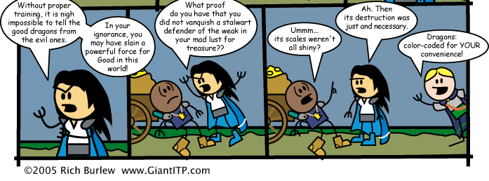

Do new characters know that goblins and kobolds are evil? What about white dragons? When kobolds ask characters to rescue their dragon, do they know to ask the kobolds about the color of the captured dragon to suss out how suspicious they should be of whether reuniting the kobolds with the dragon is a good thing?

> Socrates. Theaetetus, do you know what an aboleth is?
>
> Theaetetus. I do not.
>
> Theodorus. Why should he? Theaetetus has no ranks in Knowledge (dungeoneering). Identifying an aboleth requires a DC 18 Knowledge (dungeoneering) check. It cannot be made untrained.
>
> Socrates. An aboleth is an ancient, evil fish that enslaves minds. Theaetetus, do you know what an aboleth is?
>
> Theaetetus. An ancient...you just said it.
>
> Theodorus. What is the point of this? It proves only that you have ranks in Knowledge (dungeoneering).
>
> Socrates. Does Theaetetus have any ranks in Knowledge (dungeoneering)?
>
> Theodorus. Obviously not.
>
> Socrates. Yet he knows what an aboleth is?
>
> Theaetetus. I...how do I know whether I have ranks in Knowledge (dungeoneering)?
>
> Socrates. Calm. Focus your mind. Try to take 10. Do you know what an ecto fragment is? A diamondback viper? An ixitxachitl? A mind leech? An elan?
>
> Theodorus. Those are the most commonly known aberrations. If you have any ranks in Knowledge (dungeoneering), with your Intelligence, you should know of those.
>
> Theaetetus. I...no. No, I don't.
>
> Socrates. You say that you have no ranks in Knowledge (dungeoneering), yet you know what an aboleth is?
>
> Theodorus. I...I think I see. You don't need Knowledge ranks to remember what you've been told. If something specifically came up in your daily life, then you know it, and never mind Knowledge ranks.
>
> Socrates. Then what is Knowledge?
>
> Theodorus. Knowledge is...what you know that you haven't learned...no, that's not right. Knowledge...Knowledge comes from education. From study. If you didn't need to specifically study it, if you just ran into it in the course of your life, that's outside the scope of Knowledge.
>
> Socrates. If Theaetetus were to ask me right now what an ixitxachitl is, if I were to tell him, is that not education? Is that not study?
>
> Theodorus. That's...that's different.
>
> -- <cite>Plato's Theaetetus</cite>

Like the real Theaetetus, this one fails to yield an adequate definition of knowledge, thus ending inconclusively.

Still, the point is that characters know about goblins and kobolds whatever it's appropriate for them to know given the setting. In this case, goblins are common in the area, so people know about them.
Other humanoid races are hardly unknown. Oakhurst is a majority human town, but according to the Domesday Book, its population is 9% halfling, 5% elf, 3% dwarf, 2% gnome, 1% half-elf, and 1% half-orc.

People don't necessarily know that goblins are "evil" --- alignment is a whole other can of worms --- but they know that goblins steal livestock in the night, that they'll rob and occasionally murder travelers. Dwarves, who specifically train to fight goblins, probably know of their penchant for ambushes and will evaluate every chamber near a goblin lair for a possible ambush.

Kobolds could be rare and obscure, in some worlds, but let's say for the sake of argument that kobolds are also well-known. In the Sunless Citadel, Yusdrayl certainly acts like people should know what kobolds are: "As all know, kobolds are heir to dragons." Most people know that kobolds are paranoid and territorial to the extreme, that the set traps all around their lairs and don't much care if unwary nonkobold get maimed by them, that they scrupulously maintain a ten-mile buffer of "breathing room" around their lairs in which their patrols attack and capture any travelers, who must then be bought back. Gnomes, who specifically train to fight kobolds, probably also know that kobolds hate sunlight.

Dragons are a thornier question. Dragons are known in some places and not in others. Certainly, regardless of where they grew up, anyone who makes a DC 13 Knowledge (arcana) check identfies a white dragon on sight and knows that they can breathe a cone of icy cold. A higher check result might reveal that they burrow, swim, and climb icy surfaces.

But what about those who don't specifically train in Knowledge (arcana)? If they come from a tribe terrorized by a white dragon, obviously they know a lot, but what if they don't? Do they know general rules like "shiny scales mean good dragons"? It depends on their particular upbringing. Oakhurst locals probably don't know, since there haven't been dragons in this area for a long time.

According to https://www.gatsbyjs.org/docs/working-with-images-in-markdown/, we should be able to include images here:

